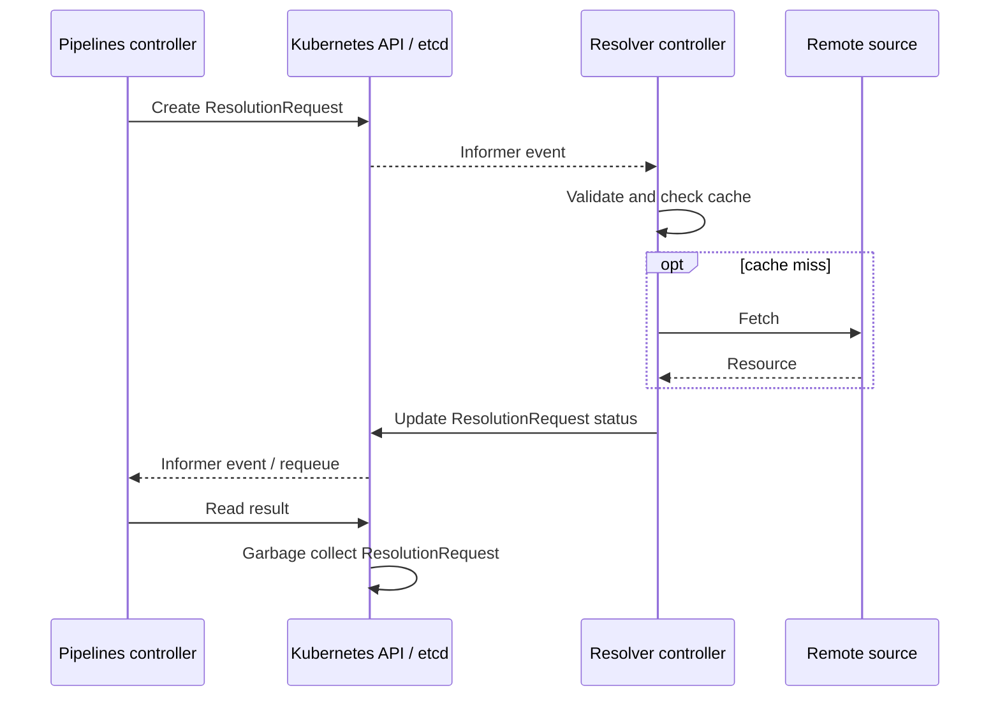
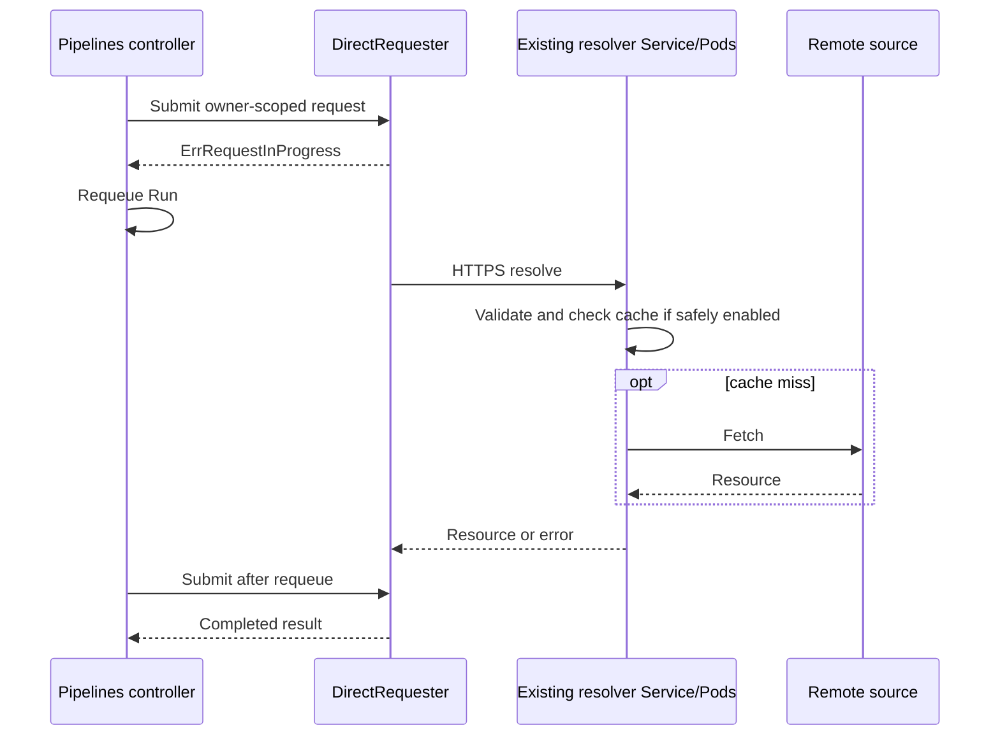

# TEP-0169: Direct Remote Resource Resolution

<!-- toc -->
- [Summary](#summary)
- [Motivation](#motivation)
  - [Goals](#goals)
  - [Non-Goals](#non-goals)
  - [Use Cases](#use-cases)
  - [Requirements](#requirements)
- [Proposal](#proposal)
  - [Before and after](#before-and-after)
  - [Notes and Caveats](#notes-and-caveats)
- [Design Details](#design-details)
  - [Request flow](#request-flow)
  - [Protocol](#protocol)
  - [Dispatch configuration](#dispatch-configuration)
  - [Caching and tenant isolation](#caching-and-tenant-isolation)
  - [Authentication](#authentication)
  - [Reliability and deadlines](#reliability-and-deadlines)
    - [Unresolved: durable per-reference deadline](#unresolved-durable-per-reference-deadline)
  - [Observability](#observability)
- [Design Evaluation](#design-evaluation)
  - [Reusability](#reusability)
  - [Simplicity](#simplicity)
  - [Flexibility](#flexibility)
  - [Conformance and user experience](#conformance-and-user-experience)
  - [Performance](#performance)
  - [Risks and Mitigations](#risks-and-mitigations)
  - [Drawbacks](#drawbacks)
- [Alternatives](#alternatives)
- [Implementation Plan](#implementation-plan)
  - [Phase 0: measure and decide](#phase-0-measure-and-decide)
  - [Phase 1: alpha implementation](#phase-1-alpha-implementation)
  - [Phase 2: evaluate graduation](#phase-2-evaluate-graduation)
  - [Test Plan](#test-plan)
  - [Infrastructure Needed](#infrastructure-needed)
  - [Upgrade and Migration Strategy](#upgrade-and-migration-strategy)
  - [Implementation Pull Requests](#implementation-pull-requests)
- [Open Questions](#open-questions)
- [References](#references)
<!-- /toc -->

## Summary

Tekton currently creates a short-lived `ResolutionRequest` for every remote
Task, Pipeline, or StepAction resolution, including cache hits. Each request
creates, updates, and later deletes a Kubernetes object.

This TEP proposes an optional direct path from the Pipelines controller to the
existing resolver service. A bounded asynchronous requester calls a versioned
internal HTTPS/JSON endpoint without changing `taskRef`, `pipelineRef`,
`stepRef`, `TaskRun`, or `PipelineRun` APIs.

The CRD path remains the default and is the only path for custom resolvers in
alpha. This TEP neither deprecates `ResolutionRequest` nor requires a new Pod,
Service, database, broker, or public resolver-registration API.

## Motivation

Resolver caching avoids repeated remote fetches but does not avoid Kubernetes
writes because the cache is checked only after a `ResolutionRequest` exists.
The workload in
[tektoncd/pipeline discussion #10644](https://github.com/tektoncd/pipeline/discussions/10644)
exceeds 80,000 TaskRuns per hour, where this internal coordination can add
material API server and etcd load.

[TEP-0060](./0060-remote-resource-resolution.md) selected an asynchronous CRD
protocol and identified direct calls as an alternative. Direct calls no longer
need to block reconciliation workers: resolution already uses a `Requester`
boundary, and Run reconcilers already schedule a timed requeue for
`ErrRequestInProgress`. Direct completion can also enqueue the owning Run to
avoid waiting for the polling interval.

### Goals

- Eliminate all `ResolutionRequest` CRUD for direct-mode resolutions.
- Preserve user-facing APIs, resolver validation, `RefSource`, Run conditions,
  Events, and trusted-resource verification.
- Keep remote I/O, memory, concurrency, and response sizes bounded.
- Preserve namespace and credential isolation.
- Support explicit per-built-in-resolver migration and rollback.
- Require measured API and etcd improvement before graduation.

### Non-Goals

- Changing public Task, Pipeline, or Run APIs.
- Replacing storage for other Tekton or Kubernetes resources.
- Deprecating `ResolutionRequest`.
- Requiring a database, broker, new resolver workload, or exactly-once fetches.
- Adding a controller-local content cache.
- Defining registration or discovery for external direct resolver services.

### Use Cases

- A high-volume cluster enables direct mode for built-in resolvers without
  changing Pipeline definitions.
- After tenant-safe caching is available, repeated immutable references return
  from the resolver cache without Kubernetes object writes.
- Built-in resolvers use direct mode while custom resolvers remain on the CRD
  path.

### Requirements

- Direct mode MUST create, update, patch, and delete zero
  `ResolutionRequest` objects.
- Remote I/O MUST NOT run on a TaskRun or PipelineRun reconciliation worker.
- Queues, active work, retained results, attempt duration, and payload sizes
  MUST be bounded.
- Completion, saturation, and cancellation MUST cause a bounded owner requeue;
  no Run may depend solely on an in-memory event to make progress.
- The CRD and direct paths MUST share framework configuration injection, cache
  parameter validation, resolver-specific timeouts, resolver validation, and
  resolved-resource validation.
- Direct and CRD modes MUST coexist without automatic fallback for an attempt.
- HTTPS and authenticated callers MUST be required, and redirects MUST be
  disabled.
- Secret values, URL credentials, and unsanitized upstream errors MUST NOT enter
  protocol payloads, logs, Events, or metric labels.
- Direct requests MUST bypass both shared-cache lookup and singleflight unless
  the cache key is tenant-safe.
- A maximum-resolution deadline MUST remain durable across controller restarts,
  or different alpha semantics MUST be explicitly accepted before enablement.
- Resolvers MUST tolerate duplicate requests.
- Operators MUST be able to return a resolver to CRD mode without editing Runs.

## Proposal

Add `DirectRequester` as a second implementation of the existing `Requester`
boundary. It records bounded in-memory work, returns `ErrRequestInProgress`, and
performs HTTPS calls outside reconciliation workers. `CRDRequester` remains
unchanged.

For built-in resolvers, the existing `tekton-pipelines-remote-resolvers`
Deployment, Service, and `cmd/resolvers` process gain an HTTPS port and handler.
The process continues serving `ResolutionRequest` controllers during migration.
The initial design adds no Pod, Deployment, sidecar, or Service.

Direct mode is disabled by default during alpha and selected explicitly per
resolver. A failed direct attempt never silently falls back to CRD mode because
that can duplicate work and bypass direct-path policy.

### Before and after

| | Before: CRD path | After: direct path |
|---|---|---|
| Coordination | `ResolutionRequest` in Kubernetes | Bounded `DirectRequester` state |
| Resolver call | Informer-driven reconciliation | Internal HTTPS request |
| Kubernetes operations | Create, status update, read, and delete | No `ResolutionRequest` CRUD |
| Cache hit | Still incurs CRD operations | No CRD writes after tenant-safe caching is enabled |
| Diagnostics | `ResolutionRequest` status | Run status, Events, logs, metrics, and traces |

**Before: `ResolutionRequest` coordination**



**After: direct coordination**



### Notes and Caveats

The direct path has no durable request object. Controller restart may repeat a
fetch, but resolved resources remain persisted through existing Run status
paths.

| CRD behavior | Direct-path replacement |
|---|---|
| Namespace in object metadata | Namespace asserted by the authenticated Pipelines controller and injected into resolver context |
| Creation timestamp | Durable per-reference deadline; unresolved below |
| Owner reference and garbage collection | Owner-scoped bounded entry removed after consumption, TTL, or deadline; completion enqueues the owner and timed requeue remains a fallback |
| Request status and conditions | Existing Run conditions and Events plus resolver metrics and traces |
| Kubernetes audit record | Authenticated structured request logs and traces; no API-object audit event |

At `proposed` status, endpoint shapes and tuning values illustrate the design.
The behavior and security requirements are normative; implementation details
may change before the TEP becomes `implementable`.

## Design Details

### Request flow

`cmd/resolvers` currently registers
`pkg/remoteresolution/resolver/framework.Resolver`, whose `Validate` and
`Resolve` methods accept `*v1beta1.ResolutionRequestSpec`. The HTTPS handler
constructs that value in memory and invokes a shared framework executor; it
does not create a Kubernetes object or require a resolver interface migration.

The shared executor preserves request namespace and resolver configuration
injection, centralized cache-parameter validation, `TimedResolution`,
`Validate`, `Resolve`, and resolved-resource validation. The CRD reconciler and
direct handler differ only in coordination and result delivery. A private
server-side context marker forces `cache.ShouldUse` to return false for direct
requests before cache lookup or singleflight; a wire parameter, including
`cache=always`, cannot override it.

The direct response returns the data and `RefSource` consumed by Pipelines.
Annotations stored only on `ResolutionRequest.status` have no Run consumer and
are omitted from version 1 of the protocol.

`DirectRequester` uses this bounded state machine:

| State | `Submit` result |
|---|---|
| Missing | Enqueue; `ErrRequestInProgress` |
| Queued, active, or backing off | `ErrRequestInProgress` |
| Succeeded | Resolved resource |
| Terminal failure | Existing permanent resolution error |

Entries are keyed by owning Run UID, the reference being resolved, and dispatch
configuration generation. They are not a shared content cache. Completion
immediately enqueues the owning Run, while the existing timed Run requeue is a
fallback for lost in-process notifications and controller failover. Queue
saturation records no work, schedules a bounded delayed owner requeue, and
returns `ErrRequestInProgress`; no unbounded goroutine is started and no Run is
left waiting for work that was never accepted.

`DirectRequester` owns transient-error backoff and jitter. Completed entries
remain only long enough for the same Run reference to consume them. Attempts
use a process-scoped context with a shorter deadline and stop on deadline or
process shutdown.

### Protocol

The alpha protocol is internal to the Pipelines controller and the built-in
resolver process:

```text
POST /v1alpha1/resolvers/{resolver}/resolve
```

Requests and responses use HTTPS/JSON with strict size limits. Parameters retain
their Tekton types and array order. `X-Request-ID` is a random correlation value,
not a cache or idempotency key.

Changes within `v1alpha1` are additive and optional; peers ignore unknown JSON
fields. Version-skew compatibility applies only after both compared releases
implement the direct protocol. Breaking changes use a new path and are served
alongside the old path during migration. Version-skew conformance tests gate
subsequent releases.

Request:

```json
{
  "namespace": "team-a",
  "params": [
    {"name": "url", "value": "https://github.com/tektoncd/catalog.git"},
    {"name": "revision", "value": "0123456789abcdef"},
    {"name": "path", "value": "task/git-clone/0.10/git-clone.yaml"}
  ],
  "url": ""
}
```

Success:

```json
{
  "data": "YXBpVmVyc2lvbjogdGVrdG9uLmRldi92MQo...",
  "refSource": {
    "uri": "https://github.com/tektoncd/catalog.git",
    "digest": {"sha256": "0123456789abcdef0123456789abcdef0123456789abcdef0123456789abcdef"}
  }
}
```

Error:

```json
{"reason": "ResolutionFailed", "message": "remote resource was not found"}
```

HTTP status determines retry behavior; the body cannot override it.

| Status | Classification |
|---|---|
| Unlisted `4xx`, including `400` and `404` | Terminal |
| `401` or `403` | Re-read the projected token once, then terminal |
| `408`, `425`, or `429` | Transient |
| `413` | Terminal |
| `5xx` | Transient |

Only `200 OK` is successful. The client disables redirects, treats every `3xx`
as a terminal protocol violation, never forwards authorization to another
location, and classifies otherwise unlisted statuses as terminal. It applies
bounded `Retry-After`, treats connection and DNS failures as transient, and
reports TLS or malformed-response failures with backoff until the overall
resolution deadline. Error bodies and headers are size-bounded and sanitized
before they can reach Run conditions, Events, logs, or traces.

### Dispatch configuration

A flat, operator-owned ConfigMap in `tekton-pipelines` selects mode for known
built-in resolvers:

```yaml
apiVersion: v1
kind: ConfigMap
metadata:
  name: config-resolver-dispatch
  namespace: tekton-pipelines
data:
  git: direct
  bundles: direct
```

Keys use the existing resolver type values such as `git`, `bundles`, `hub`,
`cluster`, and `http`. An absent ConfigMap or resolver key means `crd`. Values
are `crd` or `direct`. Unknown built-in resolver names and unknown values reject
the whole update. Invalid updates retain the last known good snapshot; without one, all
resolvers remain on CRD mode and a configuration error is reported.

The validated ConfigMap content hash is the dispatch generation, giving all
controller replicas the same stable value. Results from an older generation
cannot satisfy new submissions. TaskRun and PipelineRun controllers consume the
same typed snapshot. A direct attempt never falls back automatically.

Endpoint and trust settings are installation wiring, not live dispatch policy.
The controller Deployment supplies the built-in Service address, server name,
mounted CA path, and projected ServiceAccount token. The resolver Deployment
supplies its serving certificate, token audience, and allowed controller
identity. Operators may override this wiring in manifests, but the dispatch
ConfigMap cannot redirect requests to an arbitrary URL.

Custom resolvers remain on CRD mode in alpha. A future external direct-resolver
contract requires separate API and security review.

### Caching and tenant isolation

The current cache key omits namespace and credential/configuration scope and
sorts array values. This is independent of the transport change. A private
context marker makes `cache.ShouldUse` return false before lookup and
singleflight for every direct request, regardless of resolver defaults or a
`cache=always` parameter, until the cache implementation:

- includes namespace, resolver configuration generation, and a stable
  resolver-provided credential scope;
- preserves parameter types and array order; and
- invalidates affected entries after configuration or credential changes.

Tenant-safe caching can then be enabled per built-in resolver. If a resolver
cannot provide a safe credential scope, its direct requests remain uncached.
Resolver implementations continue loading credentials server-side; Secret
contents never cross the protocol.

### Authentication

The controller validates the built-in endpoint certificate with its mounted CA
and expected server name. Its HTTP client disables redirects. A projected
ServiceAccount token uses a fixed resolver audience and is rotated by the
kubelet. The resolver requires that audience in TokenReview and accepts only
the exact Pipelines controller ServiceAccount. Only that identity may assert
the Run namespace carried by the request.

TokenReview does not return token expiry. After a successful review, the
resolver validates the returned audience, reads `exp` from the projected JWT,
and caches the decision by token digest until the earlier of `exp` or a short
configured maximum. It does not retain the raw token and does not cache a token
whose expiry cannot be established.

The installation adds only the RBAC required to create TokenReviews. Mounted CA
and serving-certificate updates are reloaded without restarting either process.

### Reliability and deadlines

Resolver replicas are stateless except for bounded caches and singleflight.
Replica or controller failure may repeat a request; cross-replica de-duplication
and exactly-once fetching are not promised. Resolver Pod readiness depends on
resolver registration, TLS material, and its listener, not client dispatch
configuration.

Three limits apply: an overall resolution deadline, a shorter HTTPS-attempt
deadline, and queue/concurrency bounds. Each attempt is bounded by the earliest
of its configured attempt limit, the resolver's `TimedResolution` value, and
the remaining overall deadline. Backoff and `Retry-After` never extend the
overall deadline.

#### Unresolved: durable per-reference deadline

The CRD path derives its deadline from
`ResolutionRequest.metadata.creationTimestamp`. In-memory direct state cannot
preserve it across controller restart or leadership movement. Before direct mode
is enabled, the implementation must either persist an absolute per-reference
deadline on the owning Run without unbounded metadata, or explicitly document
accepted alpha restart semantics. The overall Run timeout is not equivalent
because it may be disabled.

### Observability

Direct mode exposes request, result, duration, queue, saturation, retry, timeout,
cache, and protocol metrics by resolver and mode. Trace context and a random
request ID connect Run reconciliation to resolver logs. Parameters, URLs,
revisions, Secret names, namespaces, and tokens are not metric labels or log
fields. Phase 1 audits existing built-in resolver logs, rejects URLs containing
userinfo, and adds a mandatory sanitization boundary for upstream errors before
they enter protocol responses, Run conditions, Events, logs, or traces. Existing
Run conditions and Events retain user-visible state.

## Design Evaluation

### Reusability

The design reuses `Requester`, resolver implementations, validation, error
reasons, Run requeue behavior, and resolved-resource types. It can reuse caching
and singleflight after tenant-safe keys are available.

### Simplicity

It adds one internal handler and one bounded client to existing processes while
removing a Kubernetes object lifecycle from each direct resolution. Users see no
API or YAML change.

### Flexibility

Built-in resolvers migrate independently while custom resolvers retain the CRD
contract. Alpha does not establish a third-party network API. Tekton adds no
database, broker, or storage layer.

### Conformance and user experience

Tekton's public Kubernetes-native APIs remain unchanged. Operators lose
`kubectl get resolutionrequests` for direct requests, so equivalent Run status,
Events, metrics, logs, and traces are required.

### Performance

Phase 0 measures resolution writes, API server and etcd load, controller queues,
resolver queues, cache behavior, latency, CPU, and memory for hits, misses,
outages, and restarts. Alpha graduation requires:

- zero `ResolutionRequest` CRUD in direct mode;
- bounded memory, goroutines, and queues;
- no material reconciliation or success-rate regression; and
- a material measured reduction in resolution-related API and etcd writes.

### Risks and Mitigations

| Risk | Mitigation |
|---|---|
| Controller or resolver overload | Bound queues, workers, payloads, entries, TTLs, and retries |
| Repeated fetch after restart | Require idempotent resolution and bounded retries; use cache only when tenant-safe |
| Cross-tenant cache leakage | Bypass cache until tenant-safe keys exist; disable unsafe caching |
| Endpoint redirection or token impersonation | Keep endpoint wiring out of dispatch config; validate TLS, audience, and exact caller identity; disable redirects |
| Protocol version skew | Require additive changes and conformance tests for supported release pairs |
| TokenReview API load | Cache by token digest until the earlier of token expiry or a short maximum TTL |
| Retry storm | Backoff with jitter, honor bounded `Retry-After`, export saturation |
| CRD and direct behavior drift | Shared resolver code and conformance tests |
| Reduced inspectability | Preserve Run status and Events; add metrics, traces, and logs |
| Large responses exhaust memory | Stream with a strict response limit |

### Drawbacks

- Tekton must own an internal network protocol and TLS configuration.
- Two dispatch paths temporarily increase test and maintenance cost.
- In-memory coordination can repeat work after failover.
- This removes only resolution-related Kubernetes writes.

## Alternatives

| Alternative | Why not selected |
|---|---|
| Check a controller-local cache first | Helps hits but duplicates cache policy; misses still create CRDs |
| Reduce `ResolutionRequest` writes or retention | Reduces churn but keeps Kubernetes coordination |
| Block reconciliation workers on direct calls | Resolver slowness can starve unrelated Runs |
| Embed resolvers in the Pipelines controller | Couples dependencies, RBAC, credentials, failures, and scaling |
| Use an aggregated API server or database | Moves churn and adds an operational dependency |
| Register external endpoints in nested ConfigMap YAML | Lacks schema, status, and safe Secret handling; custom direct resolution needs separate review and may warrant a typed low-cardinality CRD |
| Reintroduce `ClusterTask` | Covers only in-cluster Tasks, not git, bundle, hub, or HTTP |
| Do nothing | Acceptable if Phase 0 shows resolution writes are not material |

## Implementation Plan

### Phase 0: measure and decide

- Benchmark cache-hit and cache-miss workloads and attribute API/etcd writes.
- Compare direct resolution with smaller CRD and cache optimizations.
- Set numeric alpha and beta thresholds.
- Stop if resolution churn is not material or a smaller change meets the goal.

### Phase 1: alpha implementation

- Resolve durable deadline semantics before direct mode is enabled.
- Extract a shared executor that preserves framework context, validation, and
  timeout behavior for CRD and direct requests.
- Add the built-in protocol handler, projected-token authentication, TLS,
  redirect rejection, response sanitization, and protocol conformance tests.
- Add bounded `DirectRequester`, completion-driven owner enqueue with timed
  fallback, and typed flat dispatch configuration.
- Bypass shared-cache lookup and singleflight until tenant-safe cache-key work
  lands separately.
- Enable built-in resolvers only in tests, then as an opt-in alpha.

### Phase 2: evaluate graduation

- Run mixed-mode, failure, restart, security, load, and soak tests.
- Compare results with Phase 0 and resolve semantic differences.
- Consider a built-in default only after graduation criteria are met.
- Address `ResolutionRequest` deprecation, if any, in a later TEP.

### Test Plan

- Unit-test state transitions, limits, completion and saturation requeues,
  dispatch parsing and generations, error mapping, backoff, cache bypass,
  redirect rejection, sanitization, and authentication decisions.
- Verify `cache=always` cannot reach cache lookup or singleflight for direct
  requests across namespaces and credential scopes.
- Integration-test every built-in resolver, supported protocol skew, TLS/token
  rotation, cache behavior, replicas, restarts, and mode changes.
- End-to-end test Task, Pipeline, child Pipeline, and StepAction resolution,
  trusted resources, mixed modes, disabled Run timeouts, saturated queues, and
  unchanged Run status.
- Load-test hits, misses, outages, saturation, memory bounds, and API/etcd writes.

### Infrastructure Needed

The existing resolver Deployment, Service, and container gain port `8443`, an
HTTPS handler, serving certificate, TokenReview RBAC, readiness, graceful
shutdown, and HA/PDB guidance. The controller Deployment gains a mounted CA and
projected audience-bound token. No new project or mandatory external service is
required.

### Upgrade and Migration Strategy

Direct mode ships disabled. For the introductory release, operators upgrade all
resolver Pods, then the Pipelines controllers, and only then enable direct mode.
Before downgrading resolver Pods, operators return every resolver to CRD mode
and allow or cancel bounded direct work. Subsequent releases test protocol skew
only where both releases implement the endpoint. Dispatch-generation changes
prevent an old in-flight result from satisfying a new submission.

The existing process serves CRD and direct requests concurrently. Custom
resolvers remain on CRD mode; this TEP does not define their network
registration. No user YAML migration is required.

### Implementation Pull Requests

To be added as implementation pull requests merge.

## Open Questions

1. Where can an absolute per-reference deadline be stored durably without a new
   object or unbounded Run metadata?
2. What worker, queue, attempt-timeout, result-TTL, fallback-requeue, and payload
   defaults are safe?
3. Which cache scope can each built-in resolver prove, and when should caching
   be enabled for direct requests?
4. What measured threshold justifies implementation and graduation?

## References

- [Discussion #10644: Reducing etcd pressure from ResolutionRequest CRDs](https://github.com/tektoncd/pipeline/discussions/10644)
- [TEP-0060: Remote Resource Resolution](./0060-remote-resource-resolution.md)
- [TEP-0091: Trusted Resources](./0091-trusted-resources.md)
- [TEP-0161: Resolver Caching](./0161-resolver-caching.md)
- [Tekton Pipelines resolver framework](https://github.com/tektoncd/pipeline/tree/main/pkg/remoteresolution)
