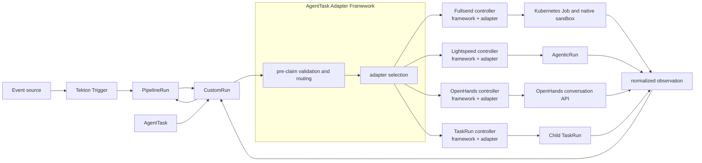
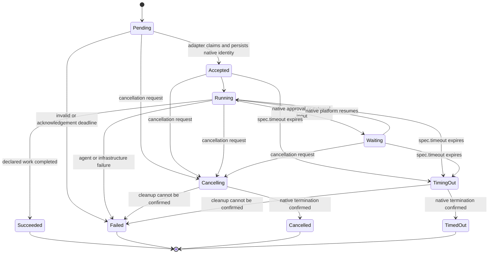

# TEP-0170: AgentTask and Pluggable Agent Execution

---

<!-- toc -->
- [Summary](#summary)
- [Motivation](#motivation)
  - [Goals](#goals)
  - [Non-Goals](#non-goals)
  - [Use Cases](#use-cases)
    - [Migrate an Existing Agent Harness](#migrate-an-existing-agent-harness)
    - [Orchestrate a Kubernetes-Native Agent Platform](#orchestrate-a-kubernetes-native-agent-platform)
    - [Orchestrate a Remote Agent Service](#orchestrate-a-remote-agent-service)
    - [Run a Containerized Agent](#run-a-containerized-agent)
    - [Use a Protocol-Based Agent](#use-a-protocol-based-agent)
  - [Requirements](#requirements)
- [Proposal](#proposal)
  - [Concepts](#concepts)
  - [Architecture](#architecture)
  - [AgentTask](#agenttask)
  - [Using AgentTask in a Pipeline](#using-agenttask-in-a-pipeline)
  - [AgentTask Adapter Framework](#agenttask-adapter-framework)
    - [Framework Responsibilities](#framework-responsibilities)
    - [AgentTask Adapter Responsibilities](#agenttask-adapter-responsibilities)
    - [Bring Your Own AgentTask Adapter](#bring-your-own-agenttask-adapter)
  - [Worked AgentTask Adapter Examples](#worked-agenttask-adapter-examples)
    - [Fullsend](#fullsend)
    - [OpenShift Lightspeed Agentic Operator](#openshift-lightspeed-agentic-operator)
    - [OpenHands](#openhands)
    - [Reference TaskRun AgentTask Adapter](#reference-taskrun-agenttask-adapter)
  - [Relationship to Remote Resolution](#relationship-to-remote-resolution)
  - [Integration with Tekton Projects](#integration-with-tekton-projects)
    - [Pipelines](#pipelines)
    - [Triggers](#triggers)
    - [Pipelines as Code](#pipelines-as-code)
    - [Results](#results)
    - [Chains](#chains)
  - [Security and Responsibility Boundaries](#security-and-responsibility-boundaries)
  - [Notes and Caveats](#notes-and-caveats)
- [Design Details](#design-details)
  - [Preliminary AgentTask API](#preliminary-agenttask-api)
  - [AgentTask Adapter Selection and Claiming](#agenttask-adapter-selection-and-claiming)
  - [AgentTask Adapter Interface](#agenttask-adapter-interface)
  - [Execution Lifecycle](#execution-lifecycle)
    - [Acknowledgement](#acknowledgement)
    - [Idempotency and Recovery](#idempotency-and-recovery)
    - [Progress and Heartbeats](#progress-and-heartbeats)
    - [Cancellation and Timeout](#cancellation-and-timeout)
    - [Cleanup](#cleanup)
    - [Retries](#retries)
  - [Status and Outcome Semantics](#status-and-outcome-semantics)
  - [Results, Logs, Artifacts, and Traces](#results-logs-artifacts-and-traces)
  - [Parameters and Workspaces](#parameters-and-workspaces)
  - [Identity and Credentials](#identity-and-credentials)
  - [Definition Resolution and Provenance](#definition-resolution-and-provenance)
  - [Conformance](#conformance)
- [Design Evaluation](#design-evaluation)
  - [Reusability](#reusability)
  - [Simplicity](#simplicity)
  - [Flexibility](#flexibility)
  - [Conformance](#conformance-1)
  - [User Experience](#user-experience)
  - [Performance](#performance)
  - [Risks and Mitigations](#risks-and-mitigations)
  - [Drawbacks](#drawbacks)
- [Alternatives](#alternatives)
  - [Use Ordinary Tasks Only](#use-ordinary-tasks-only)
  - [Use TaskRun spec.managedBy](#use-taskrun-specmanagedby)
  - [Use CustomRun Controllers Without a Framework](#use-customrun-controllers-without-a-framework)
  - [Introduce AgentRun](#introduce-agentrun)
  - [Introduce AgentTaskAdapterClass](#introduce-agenttaskadapterclass)
  - [Standardize a Generic Agent Container Protocol](#standardize-a-generic-agent-container-protocol)
  - [Add Framework-Managed Semantic Validation](#add-framework-managed-semantic-validation)
  - [Standardize an Opaque Implementation Reference](#standardize-an-opaque-implementation-reference)
  - [Use the Resolver Interface for Execution](#use-the-resolver-interface-for-execution)
  - [Depend on kagent or Another Single Runtime](#depend-on-kagent-or-another-single-runtime)
  - [Use GitHub Agentic Workflows as the Execution Model](#use-github-agentic-workflows-as-the-execution-model)
  - [Add Agent Fields to Pipeline](#add-agent-fields-to-pipeline)
- [Implementation Plan](#implementation-plan)
  - [Milestones](#milestones)
  - [Test Plan](#test-plan)
  - [Infrastructure Needed](#infrastructure-needed)
  - [Upgrade and Migration Strategy](#upgrade-and-migration-strategy)
  - [Implementation Pull Requests](#implementation-pull-requests)
- [References](#references)
<!-- /toc -->

## Summary

AI agents are increasingly used for code review, remediation, test generation,
incident diagnosis, and other work that must participate in a CI/CD graph.
Some agents are ordinary batch containers. Others are controlled by a
Kubernetes operator, a remote service, or an existing agent harness with its
own prompts, tools, approval flow, identity, sandbox, and runtime.

Tekton can run the first category as an ordinary `Task`, but it does not offer
a portable Task-like contract for the other categories. Integrations can use a
[Custom Task][custom-tasks], but each integration must independently implement
selection, validation, acknowledgement, recovery, cancellation, results, and
status normalization.

This TEP proposes:

1. A reusable, namespaced `AgentTask` definition that declares the parameters,
   workspaces, and results visible to a Pipeline and explicitly selects an
   AgentTask Adapter.
2. The existing `CustomRun` as the durable record for every `AgentTask`
   execution. This TEP does not introduce `AgentRun`.
3. An AgentTask Adapter Framework, modeled on the organizational patterns of
   Tekton's remote resolver framework, that provides the common controller
   lifecycle and a conformance contract for independently installed adapters.
4. AgentTask Adapters that preserve an agent platform's native runtime rather
   than reproducing it inside Tekton.

Tekton Pipelines remains the DAG orchestrator. An AgentTask Adapter is an
active `CustomRun` controller: it creates or calls a platform-native execution,
observes it, and maps its lifecycle back to Tekton. It may create a `TaskRun`
or Kubernetes workload, create and observe a platform-native custom resource,
or call a remote API. Fullsend, the OpenShift Lightspeed Agentic Operator, and
OpenHands are worked examples of those three integration shapes.

The proposal does not standardize prompts, models, tools, memory, agent loops,
approvals, sandboxes, or model-provider credentials. It standardizes only the
lifecycle and data that Tekton needs to schedule an agent invocation in a
Pipeline and observe its outcome.

## Motivation

A Pipeline author should be able to place an agent invocation in a graph,
provide inputs, wait for completion or approval, consume results, cancel the
run, and identify the implementation that produced the result. They should not
need to understand whether the implementation uses a Pod, a native custom
resource, or an HTTP conversation.

The existing choices each cover only part of that need:

- An ordinary `TaskRun` is strongly coupled to Tekton's Pod execution model.
  It is the preferred solution for an agent that is already a batch
  container, but not for an existing platform that owns execution elsewhere.
- `TaskRun.spec.managedBy` delegates the complete `TaskRun` lifecycle. The
  external controller must reproduce ordinary `TaskRun` behavior, and a
  Pipeline cannot currently select it as a per-task runtime in a portable way.
- `CustomRun` was designed for non-Pod execution and already carries params,
  workspaces, service account, retries, timeout, cancellation, conditions, and
  results. It is therefore the appropriate execution record.
- Custom Task authors lack a maintained framework that implements the common
  lifecycle. [TEP-0071][tep-0071] identified that gap but was deferred.
- Remote resolvers demonstrate a successful Tekton extension model, but their
  `Validate` and `Resolve` contract is a short, side-effect-free fetch that
  returns immutable bytes. An agent execution is long-running, effectful,
  observable, cancellable, and cleanup-sensitive.

Without a shared contract, every agent integration invents different
condition reasons, cancellation behavior, result mappings, log locations, and
recovery semantics. Pipeline authors then depend on each platform's API rather
than a Tekton-facing contract.

### Goals

1. Define a portable `AgentTask` contract that is meaningful to Tekton and is
   reusable across invocations.
2. Use `CustomRun` as the single execution record for `AgentTask` in a
   Pipeline or as a standalone Custom Task invocation.
3. Let users bring an existing agent implementation by installing an adapter
   controller or bridge.
4. Provide common acknowledgement, idempotency, recovery, status,
   cancellation, timeout, cleanup, and result semantics.
5. Preserve the native prompts, models, tools, approval mechanisms, memory,
   sandboxes, and internal phases of existing agent platforms.
6. Reuse Tekton params, workspaces, service accounts, Pipeline scheduling,
   `when` expressions, retries, timeouts, Triggers, Results, and Chains where
   their current contracts permit.
7. Make adapter installation and authoring comparable to resolver
   installation and authoring: explicit selection, independent deployment,
   narrow RBAC, a small interface, a template, and conformance tests.
8. Validate the design against a batch container, a Kubernetes-native
   controller, and a remote service.

### Non-Goals

1. Building an agent runtime, model gateway, prompt service, tool protocol,
   memory store, or sandbox implementation in Tekton.
2. Defining the internal phases of an agent loop or requiring all platforms to
   expose the same internal events.
3. Standardizing MCP, A2A, ACP, or another agent communication protocol.
4. Replacing a platform's native approval or human-intervention API.
5. Adding agent-specific fields to `Pipeline`, `PipelineRun`, `Task`, or
   `TaskRun`.
6. Introducing a second run resource such as `AgentRun` alongside
   `CustomRun`.
7. Requiring kagent, Fullsend, OpenShift Lightspeed, OpenHands, or any other
   agent platform.
8. Making arbitrary platform-native configuration portable. Such
   configuration remains behind the adapter boundary.
9. Guaranteeing that an agent's semantic answer is correct. Conformance covers
   execution behavior, not model quality.
10. Defining a portable semantic output validator or feedback-and-revision loop.
    Native platforms may validate before reporting success, and Pipeline authors
    may add ordinary downstream validation Tasks.

### Use Cases

#### Migrate an Existing Agent Harness

A platform team uses Fullsend for GitHub event normalization, agent harnesses,
skills, output validation, credential minting, sandbox policy, and selectable
agent runtimes. It wants Kubernetes and Tekton to replace GitHub Actions as the
workflow and execution infrastructure without rewriting those Fullsend
components.

A Tekton Trigger creates a `PipelineRun`. Ordinary Tasks prepare the source and
report back to GitHub. An `AgentTask` selects the Fullsend adapter, which runs
the existing harness in its sandbox and reports bounded results to the
`CustomRun`.

#### Orchestrate a Kubernetes-Native Agent Platform

A cluster operator already runs the OpenShift Lightspeed Agentic Operator.
Lightspeed owns `AgenticRun`, `AgenticRunApproval`, sandbox claims, step
conditions, and typed result custom resources.

An `AgentTask` selects a Lightspeed adapter. The adapter creates and observes
an `AgenticRun`, preserves Lightspeed approvals and internal phases, and maps
only the lifecycle and declared results needed by Tekton.

#### Orchestrate a Remote Agent Service

An organization runs an OpenHands Agent Server outside the Pipeline
controller. An `AgentTask` selects an OpenHands adapter. The adapter starts a
conversation, stores the conversation ID as the native execution reference,
observes events until completion, and exposes result, log, and artifact
references through the `CustomRun`.

#### Run a Containerized Agent

An agent is distributed as a Task or container and does not require a separate
platform. A reference adapter creates a child `TaskRun` and reuses Tekton's
existing Pod, workspace, result, log, and cancellation behavior. Authors who
do not need the common `AgentTask` surface can continue to use that Task
directly.

#### Use a Protocol-Based Agent

An agent already exposes a standard execution protocol such as A2A. An
adapter translates the common `AgentTask` lifecycle to that protocol. The
protocol is an implementation choice; `AgentTask` does not copy protocol
messages or platform-specific configuration into the Tekton API.

### Requirements

| ID | Requirement | Priority |
|----|-------------|----------|
| R1 | `AgentTask` MUST declare its Pipeline-visible parameters, workspaces, and results. | Must |
| R2 | `AgentTask` MUST explicitly select one adapter by a DNS-qualified name. | Must |
| R3 | A run-specific goal, event, or context MUST be provided through declared params or bound inputs, not by creating a new `AgentTask` definition for each run. | Must |
| R4 | Pipeline MUST continue to use `CustomRun` as the execution record for `AgentTask`. | Must |
| R5 | The proposal MUST NOT require a new `AgentRun` resource. | Must |
| R6 | The framework MUST acknowledge or reject an execution within a bounded interval. | Must |
| R7 | Execution creation MUST be idempotent across reconciliation and controller restart. | Must |
| R8 | The native execution identity MUST be persisted or deterministically recoverable before the adapter reports the run as accepted. | Must |
| R9 | The adapter MUST observe `CustomRun` cancellation and timeout and MUST drive the native execution toward termination. | Must |
| R10 | Terminal `CustomRun` status MUST distinguish successful completion, agent failure, infrastructure failure, `RunCancelled`, and expiry of `CustomRun.spec.timeout` with stable reasons. | Must |
| R11 | The adapter MUST confirm cleanup or leave a native execution reference and explicit cleanup failure. | Must |
| R12 | Declared scalar results MUST be consumable by downstream Pipeline tasks and `when` expressions. | Must |
| R13 | Logs, artifacts, and traces MUST be represented by bounded references rather than copied unbounded into status. | Must |
| R14 | The effective `AgentTask` identity, adapter name, adapter version, and native execution reference MUST be available for provenance. | Must |
| R15 | The framework MUST validate and present the `CustomRun` service account name and workspace bindings to the adapter; the adapter MUST document its mapping or reject an unsupported binding. | Must |
| R16 | Credentials and Secret values MUST NOT be placed in `AgentTask` params, `CustomRun` results, status messages, logs references, or provenance. | Must |
| R17 | An adapter MUST document its mapping to native sandbox, approval, output-validation, tool, model, and agent-loop controls and MUST NOT silently bypass those controls. | Must |
| R18 | A retry after native execution starts MUST create a distinct attempt identity and MUST NOT occur merely because reconciliation returned a transient error. | Must |
| R19 | Adapters MUST be independently installable and MUST receive only the RBAC needed for their backend. | Must |
| R20 | The project MUST publish an adapter conformance suite and a minimal implementation template. | Must |
| R21 | `AgentTask` definitions SHOULD be resolvable and pinned using Tekton remote resolution. | Should |
| R22 | Tekton Results SHOULD persist the complete `CustomRun` lifecycle and discover referenced agent logs and artifacts. | Should |
| R23 | Tekton Chains SHOULD attest completed `AgentTask` executions. | Should |

## Proposal

### Concepts

**AgentTask**
: A reusable, namespaced Custom Task definition. It declares the
  Pipeline-visible contract and selects an adapter. It does not describe a
  model, prompt format, tool protocol, or sandbox.

**CustomRun**
: The existing Tekton execution request and durable Pipeline child. One
  `CustomRun` represents one `AgentTask` attempt history. There is no separate
  `AgentRun`.

**AgentTask Adapter**
: An active `CustomRun` controller that maps an `AgentTask` invocation to one
  native execution backend. It owns creation or adoption, observation,
  cancellation, cleanup, and result mapping. It may create a Kubernetes
  workload or custom resource, call a remote service, or use a standard
  protocol. It is an implementation role, not a new CRD, central plugin
  registry, sidecar, or mandatory network service.

**AgentTask Adapter Framework**
: Shared controller machinery that loads and validates `AgentTask`, routes a
  `CustomRun`, manages the common lifecycle, and normalizes observations from
  an adapter.

The responsibilities are intentionally split:

| Component | Contribution |
|-----------|--------------|
| `CustomRun` | Per-run params and workspaces, Pipeline ownership, retries, timeout and cancellation requests, conditions, and results. |
| `AgentTask` | Reusable declarations, explicit adapter binding, definition identity, and validation independent of one invocation. |
| AgentTask Adapter Framework | Selection, bounded claim, idempotency, status normalization, cancellation, cleanup, and conformance. |
| Adapter | Creation and observation of the platform-native execution and mapping of native outputs. |

`AgentTask` therefore contributes more than another reference around
`CustomRun`: it gives different implementations one reusable contract that can
be validated, resolved, identified in provenance, and invoked consistently by
Pipelines.

### Architecture



Pipeline scheduling remains unchanged. When a `PipelineTask.taskRef` has the
`AgentTask` API version and kind, Pipeline treats it as a Custom Task and
creates a `CustomRun`. The framework and selected adapter reconcile that
`CustomRun`; Pipeline waits on its standard `Succeeded` condition and consumes
its standard results.

The adapter name is part of the definition rather than the `PipelineTask`.
Pipeline authors therefore do not repeat adapter plumbing at every
invocation. Changing the implementation publishes a versioned AgentTask and
updates references through the same promotion process used for other Task
definitions.

### AgentTask

An `AgentTask` contains only fields consumed by the AgentTask API, framework,
or Pipeline contract:

```yaml
apiVersion: agent.tekton.dev/v1alpha1
kind: AgentTask
metadata:
  name: repository-review
spec:
  description: Review a repository change and return a bounded decision.
  params:
    - name: request
      type: string
      description: The requested review goal.
    - name: revision
      type: string
      description: The immutable source revision to inspect.
  workspaces:
    - name: source
      description: Checked-out source for adapters that support a workspace.
  results:
    - name: outcome
      description: The adapter-defined review outcome.
    - name: report-url
      description: A reference to the complete report.
  adapterRef:
    name: fullsend.ai/agenttask-adapter
    params:
      - name: agent
        value: review
```

`spec.params`, `spec.workspaces`, and `spec.results` are the reusable contract.
`spec.adapterRef` binds that contract to an installed implementation.
Adapter params identify existing platform configuration, such as a Fullsend
agent, a Lightspeed adapter profile, an OpenHands profile, or a Task.

The following do not become portable `AgentTask` fields:

- model name or provider credentials;
- system prompt or agent instructions;
- MCP servers or tool definitions;
- internal planning, execution, or verification phases;
- conversation memory;
- native approval policy;
- container, Pod, sandbox, or virtual-machine templates.

Those belong to the selected implementation. Adding them to the common API
would couple Tekton to one runtime and make existing platforms surrender
working controls.

### Using AgentTask in a Pipeline

```yaml
apiVersion: tekton.dev/v1
kind: Pipeline
metadata:
  name: review-change
spec:
  params:
    - name: request
      type: string
    - name: revision
      type: string
  workspaces:
    - name: source
  tasks:
    - name: fetch-source
      taskRef:
        name: git-clone
      params:
        - name: revision
          value: $(params.revision)
      workspaces:
        - name: output
          workspace: source

    - name: review
      runAfter: [fetch-source]
      taskRef:
        apiVersion: agent.tekton.dev/v1alpha1
        kind: AgentTask
        name: repository-review
      params:
        - name: request
          value: $(params.request)
        - name: revision
          value: $(params.revision)
      workspaces:
        - name: source
          workspace: source

    - name: report
      runAfter: [review]
      taskRef:
        name: report-review
      params:
        - name: outcome
          value: $(tasks.review.results.outcome)
        - name: report-url
          value: $(tasks.review.results.report-url)
```

Pipeline authors use normal task dependencies, params, workspaces, result
references, retries, timeouts, `when` expressions, and finally tasks. Creating
a `CustomRun` directly remains the standalone invocation mechanism.

### AgentTask Adapter Framework

The framework follows the resolver framework's extension model but uses a
non-blocking reconciliation contract. It consists of a small pre-claim
lifecycle reconciler and a controller library embedded in each Go adapter
controller. The library calls the adapter implementation in-process; there is
no unspecified RPC or intermediate request resource.

Each adapter is compiled and deployed as a controller. A distribution may
bundle several adapter controllers in one binary, as Tekton does for built-in
resolvers, but this is packaging rather than a dynamic plugin system.

#### Framework Responsibilities

The framework:

1. watches `CustomRun`s that reference or embed `AgentTask`;
2. loads or resolves the effective `AgentTask`;
3. validates declared params, workspaces, results, and adapter selection;
4. records the effective definition identity and adapter selection;
5. gives an installed adapter a bounded claim interval;
6. initializes standard conditions, attempt identity, and timestamps;
7. supplies a stable idempotency key derived from the `CustomRun` UID and
   attempt number;
8. handles framework-owned cancellation, timeout, heartbeat, and finalizer
   behavior;
9. serializes adapter observations into standard conditions, results, and
   bounded references;
10. emits Tekton events and metrics; and
11. prevents two adapter controllers from owning the same run.

#### AgentTask Adapter Responsibilities

An adapter:

1. validates implementation-specific params without exposing credentials;
2. creates or adopts exactly one native execution for an attempt;
3. persists or deterministically reconstructs its native execution identity;
4. observes native progress without blocking a reconcile call;
5. maps native state to the common observation model;
6. requests native cancellation and confirms termination;
7. confirms cleanup or reports a durable cleanup reference;
8. maps declared scalar results; and
9. publishes references to logs, artifacts, traces, and native detail.

In the Go path, the adapter implementation does not patch `CustomRun`; it
returns an observation to the framework wrapper in the same process. After an
atomic claim, that wrapper is the sole status writer for the run. The
pre-claim reconciler no longer mutates its status.

#### Bring Your Own AgentTask Adapter

An agent platform author has two supported paths:

- Implement the Go adapter interface and use the supplied controller
  framework and project template.
- Implement a controller directly against the `AgentTask` and `CustomRun`
  APIs. After claiming a run, that controller becomes its sole status writer
  and implements the same compare-and-swap ownership, lifecycle, and
  conformance requirements. This permits implementations in other languages.

An implementation advertises a DNS-qualified selector such as
`fullsend.ai/agenttask-adapter`. Installing that implementation does not require adding
a platform-specific CRD to Tekton or registering code in a central service.
The implementation may, of course, use its own CRDs behind the boundary.

A platform that already implements a suitable execution protocol can provide a
thin protocol adapter. A platform without such a protocol provides a native
controller or API bridge. Merely placing an opaque object reference in
`AgentTask` is insufficient: the adapter must implement the common lifecycle.

### Worked AgentTask Adapter Examples

The following examples are non-normative. They validate that the common
boundary accommodates materially different platforms. Fullsend workflow
files, OpenShift Lightspeed CRDs, OpenHands payloads, commands, prompts, and
configuration do not become part of the `AgentTask` API.

Each adapter must define the same boundary explicitly:

| Adapter | Native identity | Workspace and identity | Results and observability | Cancellation and cleanup |
|---------|-----------------|------------------------|---------------------------|--------------------------|
| Fullsend | Deterministic Job name or service run ID keyed by the CustomRun attempt. | Mount the bound workspace into the Job, or upload an immutable snapshot; use the CustomRun service account only for a Kubernetes workload. | Validated Fullsend output becomes declared scalar results plus report and transcript references. | Stop the Job or service run, observe termination, and remove run-scoped sandbox resources. |
| Lightspeed | Deterministic `AgenticRun` name and UID. | Map only bindings supported by the selected adapter profile; otherwise reject them. Lightspeed retains sandbox identity. | Map terminal conditions and scalar summaries; reference typed result CRs and sandbox logs. | Request the supported native stop operation or deletion, observe a terminal condition, and confirm child cleanup. |
| OpenHands | Conversation ID persisted before acceptance. | Use an operator-managed workspace/profile mapping and workload identity; never send the Kubernetes service-account token. | Map bounded terminal values; reference the conversation, trajectory, workspace artifacts, and logs. | Request stop/delete, confirm authoritative conversation termination, then apply the configured workspace-retention policy. |

#### Fullsend

Fullsend separates event dispatch, agent infrastructure, sandbox, harness, and
runtime. Its harness owns agent instructions, skills, output-schema
validation, pre- and post-scripts, runtime selection, credential minting, and
sandbox policy. These should remain Fullsend concerns.

A Fullsend-backed definition may look like:

```yaml
apiVersion: agent.tekton.dev/v1alpha1
kind: AgentTask
metadata:
  name: fullsend-review
spec:
  params:
    - name: event
      type: object
    - name: revision
      type: string
  workspaces:
    - name: source
  results:
    - name: outcome
    - name: report-url
  adapterRef:
    name: fullsend.ai/agenttask-adapter
    params:
      - name: agent
        value: review
```

The adapter would:

1. convert declared Tekton params and source bindings into Fullsend's existing
   normalized dispatch input;
2. create a deterministically named Kubernetes Job or invoke a managed
   Fullsend service using the `CustomRun` attempt identity, and persist the Job
   or service run ID before acceptance;
3. mount the workspace and use the CustomRun service account for a Job, or use
   a documented immutable upload and workload-identity mapping for a managed
   service;
4. let Fullsend select and bootstrap its runtime, harness, skills, sandbox,
   credentials, and policy;
5. observe the Fullsend process and validated structured output;
6. return bounded scalar results and references to the complete report and
   transcript; and
7. request termination on cancellation or timeout, observe it, and confirm
   cleanup of run-scoped sandbox resources.

A GitHub migration becomes:

```text
GitHub webhook
  -> Tekton Trigger
  -> PipelineRun
       -> source preparation Task
       -> Fullsend-backed AgentTask
       -> GitHub reporting Task/finally Task
```

GitHub remains the source of events, repository intent, and status reporting.
Tekton replaces GitHub Actions as the workflow graph and Kubernetes execution
infrastructure. Fullsend retains its own agent definitions, security hooks,
sandbox, credential exchange, runtime adapters, behavior tests, and output
validation. No Fullsend-specific CRD or command is required by this TEP.

#### OpenShift Lightspeed Agentic Operator

The OpenShift Lightspeed Agentic Operator is Kubernetes-native. It already
owns the `AgenticRun` lifecycle, per-step conditions, `AgenticRunApproval`,
sandbox resources, and typed Analysis, Execution, Verification, and Escalation
result custom resources.

This follows the integration model in the Lightspeed
[Component Developer Guide][lightspeed-component-guide]. In that model, a
component-owned adapter receives an event and creates a namespaced
`AgenticRun`; the operator owns the subsequent agent and sandbox lifecycle. A
Lightspeed adapter plays that adapter role for a Tekton `CustomRun`. The
guide's current step 3 is **Create an AgenticRun**. `Proposed` is a phase
derived later from `AgenticRun` conditions, not a separate Proposal resource.

A Lightspeed-backed `AgentTask` selects the adapter and an adapter-managed
profile. The profile is adapter configuration that materializes Lightspeed's
inline workflow fields; it is not a new Lightspeed CRD:

```yaml
adapterRef:
  name: lightspeed.openshift.io/agenticrun
  params:
    - name: profile
      value: remediation
```

The adapter would:

1. create an `AgenticRun` with a deterministic name and correlation labels
   derived from the `CustomRun` attempt because Lightspeed does not deduplicate
   runs for adapters;
2. use its own controller service account with the namespace-scoped access
   described by Lightspeed, such as the `lightspeed-component-owner` role. The
   `CustomRun` service account name does not authorize the controller's API
   request;
3. map the declared request and target namespaces, then let the selected
   adapter profile materialize native workflow shape, agent names,
   `analysisOutput`, skills images, tools, and same-namespace
   `requiredSecrets` references;
4. keep Secret values out of `AgentTask` and `CustomRun` and reject any
   service-account or workspace binding the profile cannot honor;
5. watch conditions and derive native phase. `Proposed` and `Escalating` are
   non-terminal and must not be reported as completed;
6. report `WaitingForApproval` to Tekton while the native
   `AgenticRunApproval` remains the approval authority;
7. map terminal native conditions to the common outcome taxonomy and expose
   scalar summaries plus references to typed result CRs and sandbox logs; and
8. use a platform-supported per-run cancellation operation when available,
   otherwise delete the `AgenticRun` and observe child cleanup. An adapter
   must not toggle a cluster-wide emergency stop for one `CustomRun`.

The adapter does not flatten Lightspeed's remediation, assisted, or advisory
workflow shapes into separate Tekton Tasks. Tekton orchestrates around one
logical agent invocation; Lightspeed continues to orchestrate inside it.

#### OpenHands

OpenHands Agent Server exposes conversations and events through an HTTP and
WebSocket API. It owns the agent implementation, workspace, tools, sandbox,
conversation history, and provider configuration.

An OpenHands-backed definition selects an operator-managed profile:

```yaml
adapterRef:
  name: openhands.dev/agent-server
  params:
    - name: profile
      value: repository-change
```

The adapter would:

1. create a conversation using the declared goal and profile;
2. map a bound workspace through the profile's documented repository,
   snapshot, or persistent-workspace mechanism and reject unsupported
   bindings;
3. use the `CustomRun` attempt identity as an idempotency or correlation key;
4. persist the returned conversation ID before reporting the run accepted;
5. use the event stream only as a reconciliation trigger and derive terminal
   state from the authoritative conversation-state endpoint, so unknown event
   variants do not block observation;
6. expose the conversation URL, trajectory, workspace outputs, and logs as
   references;
7. map declared bounded results from the terminal conversation; and
8. on cancellation or timeout, request stop/delete, confirm authoritative
   termination, and apply the configured workspace-retention policy.

The `AgentTask` does not embed an OpenHands conversation request. Adapter
params refer to an operator-managed OpenHands profile, while run-specific
values remain declared Tekton params.

#### Reference TaskRun AgentTask Adapter

A reference adapter may create a child `TaskRun` for users whose agent is
already packaged as a Tekton Task. It would:

- resolve the referenced Task using existing resolution support;
- map matching params and workspaces;
- set an owner reference to the `CustomRun`;
- observe standard TaskRun conditions and results;
- reuse TaskRun logs, Pod cancellation, compute configuration, and Chains
  support; and
- propagate only declared AgentTask results.

This adapter is an onboarding and conformance implementation, not a reason to
wrap every Task. If the Pipeline does not need a portable `AgentTask`
contract, the Task should be referenced directly.

### Relationship to Remote Resolution

Resource resolution and execution are separate stages:

```text
AgentTask reference
  -> resolve and pin definition
  -> create/claim CustomRun
  -> execute native workload or service
```

The existing resolver architecture provides useful patterns:

| Resolver pattern | Agent execution use |
|------------------|---------------------|
| Explicit selector | `adapterRef.name` |
| `ResolutionRequest` envelope | Existing `CustomRun` envelope |
| Deterministic request identity | Attempt idempotency key and native name |
| Owner references | Native Kubernetes child ownership |
| Shared framework and template | AgentTask Adapter Framework and template |
| ConfigMap watcher | Optional adapter administrator configuration |
| Narrow per-resolver RBAC | Narrow per-adapter RBAC |
| Source and digest metadata | Resolved AgentTask identity and digest |
| Conformance tests | Adapter lifecycle conformance |

The resolver method set itself is not reused. `Resolve` performs a bounded
fetch and returns immutable bytes. Agent execution must persist a native
handle, repeatedly observe state, surface progress, handle external effects,
cancellation and cleanup, and survive controller restarts.

An `AgentTask` referenced through a resolver should eventually produce the same
pinned definition metadata as a resolved Task. This requires extending remote
resolution and Custom Task handling to accept and snapshot `AgentTask`
definitions. Execution never occurs inside a resolver.

### Integration with Tekton Projects

#### Pipelines

Pipeline already creates a `CustomRun` for a task reference with a non-Task
API version and kind. `CustomRun` supplies params, workspace bindings, service
account name, retries, timeout, cancellation request, conditions, string
results, retry history, and schemaless extra fields.

The initial implementation can therefore add the `AgentTask` CRD and
controllers without adding agent-specific Pipeline fields. The AgentTask
framework validates the definition-level contract and writes standard
`CustomRun` status.

#### Triggers

Triggers remains the event-to-`PipelineRun` entry point. Event normalization
may be performed by a Trigger binding, an ordinary Task, or the selected
platform. `AgentTask` does not define a GitHub-, GitLab-, alert-, or
message-specific event schema.

#### Pipelines as Code

[Pipelines as Code][pipelines-as-code] may create a `PipelineRun` containing
`AgentTask`s in response to a Git event. It retains ownership of event normalization and VCS
status reporting; AgentTask adds no repository-provider event schema. AgentTask
definitions use the same cluster promotion or remote-resolution mechanisms as
other reusable definitions, and Pipelines as Code does not install adapters.
A Phase 3 end-to-end test should cover Git event to `PipelineRun` to
`AgentTask` completion.

#### Results

Tekton Results already persists the `CustomRun` lifecycle. It does not collect
CustomRun logs because a Custom Task is not necessarily Pod-backed. This TEP
requires an adapter to publish log and artifact references. A Results
integration should discover those references and associate external log
providers or records with the owning `CustomRun` and `PipelineRun`.

Large transcripts, prompts, model responses, source archives, and structured
reports must not be stored directly in Kubernetes status or ordinary Tekton
results. They belong in an access-controlled artifact or logging backend.

#### Chains

Tekton Chains currently observes `TaskRun` and `PipelineRun`, not `CustomRun`.
Chains support must be extended, or an equivalent PipelineRun-level
attestation must include completed AgentTask evidence.

The minimum attested evidence is:

- effective AgentTask name, UID, resource version, and content digest;
- adapter selector and implementation version;
- `CustomRun` UID and attempt identity;
- native execution reference or a privacy-preserving digest;
- declared input source references and digests when available;
- terminal reason and declared result/artifact references; and
- timestamps and owning PipelineRun identity.

Raw prompts, Secret values, credentials, unrestricted transcripts, and
sensitive model responses are excluded by default.

This TEP defines the minimum evidence contract, not the internal Chains
implementation. Changes to Chains watchers, APIs, or attestation formats require
a follow-up Chains design or TEP during Phase 3 and do not block AgentTask
alpha.

### Security and Responsibility Boundaries

The framework is responsible for secure lifecycle plumbing, not for replacing
an adapter's sandbox or tool policy.

| Concern | Owner |
|---------|-------|
| Pipeline ordering, timeout request, workspace binding, service account selection | Tekton Pipeline and CustomRun |
| AgentTask validation, adapter claim, common status, idempotency, cancellation coordination | AgentTask Adapter Framework |
| Model, prompt, tools, memory, internal approvals, sandbox, native policy | Selected agent platform |
| Mapping Tekton identity and inputs into the platform without credential leakage | Adapter |
| Cluster admission, namespace quotas, network policy, and workload policy | Cluster operator |
| External-service identity and short-lived credential exchange | Adapter/platform identity provider |
| Result, log, artifact, and provenance access control | Tekton installation and backend operators |

Adapter controllers receive the `CustomRun` service account name, but their
own Kubernetes API calls still use the controller's identity and RBAC. The
field does not grant impersonation. A Kubernetes adapter may create a child
workload using the selected service account if its controller is authorized to
do so. A remote adapter must not copy a service-account bearer token into a
remote service; it should use workload identity or an explicit, scoped
exchange supported by its platform.

A workspace binding is authority to use the bound data only through the
adapter's documented mapping. An adapter that cannot safely map a workspace
must reject it with `CustomRunWorkspaceNotSupported` rather than silently
ignoring it.

### Notes and Caveats

- `CustomRun` currently supports only string results. The alpha AgentTask API
  therefore exposes scalar string results; structured or large outputs use
  artifact references until CustomRun gains typed results.
- `CustomRun.status.extraFields` is schemaless. The alpha framework can define
  and version a reserved AgentTask status profile there, but a future
  `CustomRun` API should provide typed execution and artifact references.
- Existing custom controllers are not automatically conformant adapters.
  They must implement the acknowledgement, idempotency, cancellation,
  cleanup, and status contract.
- Native approval remains platform-specific. Tekton can display a waiting
  state and link to the approval object or service, but this TEP does not
  create a universal approval API.
- An agent may complete successfully while returning a negative business
  decision such as `approved=false`. That is a successful execution with a
  result, not an infrastructure failure.
- DNS-qualified adapter names prevent accidental naming collisions but do
  not provide installation discovery. The alpha design uses bounded claiming;
  an `AgentTaskAdapterClass` resource may be considered later only if operational
  discovery and capability advertisement prove necessary.

## Design Details

### Preliminary AgentTask API

The following structure is preliminary and subject to API review:

```go
type AgentTaskSpec struct {
    Description string                 `json:"description,omitempty"`
    Params      []ParamSpec            `json:"params,omitempty"`
    Workspaces  []WorkspaceDeclaration `json:"workspaces,omitempty"`
    Results     []AgentTaskResult       `json:"results,omitempty"`
    AdapterRef  AgentTaskAdapterRef    `json:"adapterRef"`
}

type AgentTaskAdapterRef struct {
    Name   string  `json:"name"`
    Params []Param `json:"params,omitempty"`
}

type AgentTaskResult struct {
    Name        string `json:"name"`
    Description string `json:"description,omitempty"`
}
```

`spec.description` is optional human-readable documentation for users and UIs,
like a Task description. It is not a prompt, graph, or other executable adapter
input, and adapters must not derive execution behavior from it. Run-specific
goals and prompts use declared params or workspaces; platform-native graphs and
configuration remain behind `adapterRef`. This permits LangGraph-style adapters
without changing the AgentTask contract.

The API should reuse Tekton parameter and workspace declaration types when
versioning and dependency boundaries allow it. Alpha result values are
strings because `CustomRunResult.Value` is currently a string.

Normative validation includes:

- `adapterRef.name` is required and DNS-qualified;
- param, workspace, and result names are unique;
- adapter params have unique names;
- runtime params not declared by the AgentTask are rejected;
- required params and workspaces are present;
- result names produced by an adapter were declared; and
- `adapterRef` and the Pipeline-visible contract are immutable.

Immutability prevents an in-flight reference from silently changing meaning.
A changed implementation or contract uses a new AgentTask name or resolved
revision. Metadata that does not affect execution may remain mutable.

The API does not require a cluster-scoped `ClusterAgentTask`. Namespaced
resources, remote resolution, and normal promotion tooling cover the initial
use cases without a second definition kind.

### AgentTask Adapter Selection and Claiming

Current Custom Task filters distinguish only API version and kind. Every
AgentTask adapter would therefore observe the same `CustomRun` kind unless a
second selector is introduced.

The framework uses this sequence:

1. The AgentTask lifecycle reconciler loads the referenced or embedded
   definition and validates it.
2. It writes the immutable label
   `agent.tekton.dev/adapter=<encoded-selector>` and the effective AgentTask
   digest to the `CustomRun`.
3. Adapter controllers filter on that label and independently reconcile only
   their selector.
4. A matching adapter atomically writes its stable installation identity,
   `claimedAt`, and initial heartbeat to the reserved AgentTask status. All
   replicas of one controller deployment share that installation identity.
5. After the claim succeeds, the framework wrapper embedded in that adapter
   controller is the sole status writer. The pre-claim reconciler stops
   mutating status, and a controller with a different installation identity
   stops when it observes the claim.
6. If no adapter claims the run before the configured acknowledgement
   deadline, the pre-claim reconciler marks it failed with
   `AgentTaskAdapterNotFound`.

The label value must use a reversible or collision-resistant encoding because
Kubernetes label values cannot contain every character allowed in a
DNS-qualified selector. The unmodified selector remains in status and
provenance.

This uses the existing `CustomRun` as the request envelope. It does not add an
adapter registration CRD or an internal `AgentExecutionRequest` that would
become a second run record.

### AgentTask Adapter Interface

A Go interface may resemble the following, but observable behavior rather
than this exact method set is normative:

```go
type AgentTaskAdapter interface {
    Initialize(context.Context) error
    Name(context.Context) string
    Validate(context.Context, *AgentTask, *CustomRun) error
    Reconcile(context.Context, Request) (Observation, error)
    Cancel(context.Context, Request) (Observation, error)
}
```

`Request` contains the effective immutable AgentTask, CustomRun, attempt
identity, selected service account, workspace bindings, and adapter
administrator configuration.

`Observation` contains bounded state:

```go
type Observation struct {
    State          State
    Reason         string
    Message        string
    ExecutionRef   *ExecutionReference
    Results        []CustomRunResult
    Logs           []Reference
    Artifacts      []Reference
    Traces         []Reference
    RequeueAfter    time.Duration
    CleanupComplete bool
}
```

`Reconcile` and `Cancel` must return quickly. A long operation happens in the
native platform; the controller watches, polls, or requeues. Implementations
must not retain the only copy of execution state in process memory. For this
interface, the framework wrapper and adapter implementation run in the same
controller process; `Observation` is not a network protocol.

An adapter error means the controller could not complete reconciliation. It
is not automatically an agent failure. Typed errors distinguish transient
controller/backend errors, invalid requests, missing dependencies, and
terminal native failures.

### Execution Lifecycle



These phases are represented through the standard `Succeeded` condition and a
versioned AgentTask status profile; they do not add another Pipeline state
machine. Native internal phases may be shown in a backend-specific detail
field or link but do not affect Pipeline scheduling unless mapped to the
common lifecycle.

#### Acknowledgement

A run is accepted only after the adapter has either:

- created or adopted a native execution and persisted its reference; or
- reserved an idempotent remote execution key that can be recovered after a
  restart.

Merely receiving an informer event is not acknowledgement. The framework
records claim and acceptance latency. An unclaimed or repeatedly unavailable
adapter produces a terminal condition rather than leaving a Pipeline waiting
indefinitely.

#### Idempotency and Recovery

The framework supplies an idempotency key derived from:

```text
<CustomRun UID>:<attempt number>
```

Kubernetes adapters use a deterministic child name plus owner or correlation
metadata. Remote adapters pass an idempotency key when supported and persist
the returned native ID. When the backend lacks idempotent creation, the
adapter must implement lookup by correlation key before creating another run.

On restart, the adapter first adopts the recorded or deterministic native
execution. It must not create another execution because an in-memory cache was
lost.

#### Progress and Heartbeats

The adapter framework records bounded progress messages and a heartbeat while
an execution is active. A heartbeat proves that the controller can still
observe the backend; it does not require the agent itself to emit synthetic
progress.

A stale heartbeat is an observability and alerting signal; it does not by
itself rewrite the run's terminal state. Another replica with the same stable
installation identity may reconcile and adopt the native execution. Automatic
takeover by a differently configured adapter installation is not permitted.
If the selected adapter later proves that the native execution failed, it
reports `InfrastructureFailed` and preserves the native reference.

#### Cancellation and Timeout

Pipeline cancellation is expressed through the existing
`CustomRun.spec.status=RunCancelled`. Before an adapter claims the run, the
pre-claim reconciler can terminate it immediately because no native execution
exists. After claim, the selected framework wrapper calls the adapter's
cancellation path until the backend confirms terminal state or the cleanup
deadline expires, then uses the existing `CustomRunCancelled` reason.

Pipeline currently uses the same `RunCancelled` value when the owning
PipelineRun times out; only `statusMessage` distinguishes that source. This
TEP preserves that behavior rather than claiming a typed timeout cause that
CustomRun does not carry.

`CustomRun.spec.timeout` is separately authoritative for the invocation. If it
expires before claim, the pre-claim reconciler marks the run timed out without
calling an adapter. After claim, the selected wrapper requests native
termination and, after confirmation, uses the existing
`CustomRunTimedOut` reason. An adapter should also configure a native timeout
when the backend supports one, but a missing native timeout does not remove
the framework's obligation to act.

The framework does not mark a run cancelled or timed out merely because it
sent a request. Failure to confirm native termination becomes `CleanupFailed`
with the native reference retained.

#### Cleanup

Kubernetes child resources use controller references when valid. Cross-
namespace resources and remote executions use correlation labels or IDs and a
finalizer on the `CustomRun`.

The finalizer remains until the adapter confirms that run-scoped resources
are deleted or intentionally retained by a declared backend policy. The
framework uses an operator-configured maximum cleanup interval so a broken
remote service cannot block Kubernetes deletion forever. Expiry removes the
finalizer only after recording `CleanupFailed` and the recovery reference.

#### Retries

Controller reconciliation retries and agent execution retries are different:

- A transient API error requeues reconciliation of the same attempt.
- `CustomRun.spec.retries` is the maximum number of additional execution
  attempts. The current zero-based attempt number is
  `len(status.retriesStatus)`.
- When an adapter reports a terminal retryable failure, the framework first
  confirms native termination and cleanup. If retries remain, it appends a
  deep copy of the completed current status, including its condition,
  execution reference, and AgentTask extra fields, to
  `status.retriesStatus`.
- In the same conflict-checked status transition, the framework clears
  attempt-scoped current fields and marks the run `Running` with reason
  `Retrying`. The new attempt ID is then derived from the CustomRun UID and the
  new `len(status.retriesStatus)` value.
- If no retries remain, the terminal failure stays on the current status.
- An agent or tool action inside the native platform may retry according to
  native policy without becoming a new Tekton attempt.

Because the archived retry status is the authoritative attempt counter, a
controller restart cannot increment it from memory. The retry transition is a
durable gate: the framework performs a resource-version-checked status update
and ends that reconciliation without creating the next native execution. A
later reconciliation may start the next attempt only after observing the
persisted retry history and derived attempt ID.

If the status update conflicts, fails, or returns an uncertain response, the
framework re-reads the `CustomRun`. It either observes the committed transition
or retries the same transition; it never increments an in-memory counter. The
deterministic attempt idempotency key then prevents duplicate native creation.
Because agents may make external changes, the framework never starts a new
attempt solely because status observation temporarily failed. The adapter
explicitly marks whether a terminal infrastructure failure is safe to retry.

### Status and Outcome Semantics

Pipeline continues to read the standard `Succeeded` condition:

| Condition | Common reason | Meaning |
|-----------|---------------|---------|
| Unknown | `Pending` | Definition is being validated or waiting for a claim. |
| Unknown | `Accepted` | Native identity is durable; work has not yet started. |
| Unknown | `Running` | Native execution is active. |
| Unknown | `WaitingForApproval` | Native platform is waiting for human or external input. |
| True | `Succeeded` | Invocation completed and declared results are valid. |
| False | `InvalidAgentTask` | Definition or runtime bindings are invalid. |
| False | `AgentTaskAdapterNotFound` | No matching adapter claimed the run. |
| False | `AgentFailed` | Native agent completed unsuccessfully. |
| False | `InfrastructureFailed` | Adapter, platform, sandbox, or workload failed. |
| False | `CustomRunWorkspaceNotSupported` | The selected adapter cannot honor a bound workspace. |
| False | `CustomRunCancelled` | A `RunCancelled` request was observed and native termination was confirmed. |
| False | `CustomRunTimedOut` | `CustomRun.spec.timeout` elapsed and native termination was confirmed. |
| False | `CleanupFailed` | Native termination or cleanup could not be confirmed. |

An agent's domain decision is a result. For example, a security reviewer that
returns `outcome=reject` has successfully performed its work. It should be
`Succeeded=True`; a downstream `when` expression decides whether deployment
continues.

Failure classification follows the failing boundary, not an HTTP status code:

| Observation | Framework behavior |
|-------------|--------------------|
| A transient adapter or backend API error, including `429` while observing an active execution | Requeue the same attempt without changing terminal status. |
| The native execution terminates because a model provider, required tool service, platform, or sandbox is unavailable or rate limited | `InfrastructureFailed`. |
| The native agent terminates because it could not complete its assigned work while its execution environment remained available | `AgentFailed`. |
| The agent completes and returns a negative domain decision | `Succeeded=True` with the declared result. |

Retryability is separate from classification. A terminal failure starts a new
Tekton attempt only when the adapter marks it safe to retry and cleanup is
confirmed. If the native platform handles a rate limit internally, it remains
within the current attempt. Conformance tests cover these common mappings;
an adapter with an opaque backend must document its conservative mapping and
preserve the native reason in bounded detail.

The alpha status profile stored in `CustomRun.status.extraFields` includes:

```yaml
schemaVersion: agent.tekton.dev/v1alpha1
agentTask:
  apiVersion: agent.tekton.dev/v1alpha1
  name: repository-review
  uid: 6d3c...
  resourceVersion: "1042"
  digest: sha256:...
adapter:
  name: fullsend.ai/agenttask-adapter
  version: v0.1.0
  installationID: fullsend-agenttask-adapter.production
  claimedAt: "..."
  lastHeartbeatTime: "..."
attempt:
  number: 0
  id: 6d3c...:0
executionRef:
  apiVersion: batch/v1
  kind: Job
  namespace: ci
  name: repository-review-6d3c
  uid: 9b4a...
logs:
  - name: agent
    uri: https://logs.example/runs/6d3c
artifacts:
  - name: report
    uri: oci://registry.example/reports@sha256:...
```

The status profile has these normative ownership and compatibility rules:

| Field | Required | Writer | Rule |
|-------|----------|--------|------|
| `schemaVersion` | Always | Pre-claim reconciler | Readers reject an unsupported major schema and ignore unknown additive fields. |
| `agentTask` identity and digest | Always | Pre-claim reconciler | Immutable after routing; identifies the exact local or resolved definition. |
| `adapter.name` | Always | Pre-claim reconciler | Equals the unmodified `adapterRef.name`. |
| `adapter.installationID`, version, and claim time | After claim | Selected framework wrapper | Written by compare-and-swap; immutable for the attempt. |
| `adapter.lastHeartbeatTime` | While active | Selected framework wrapper | Rate-limited and monotonically nondecreasing. |
| `attempt.number` and `attempt.id` | Always | Framework | Derived from retry history and CustomRun UID; immutable within an attempt. |
| `executionRef` | From acceptance | Selected framework wrapper | Required before `Accepted`; immutable except to add server-assigned identity fields. |
| `logs`, `artifacts`, and `traces` | Optional | Selected framework wrapper | At most 32 references per category; names are unique and URIs are at most 2048 bytes. |

Condition messages are at most 4096 bytes. Each status writer uses a
resource-version-checked patch. The pre-claim reconciler writes only while no
adapter claim exists; after claim, the selected framework wrapper owns the
profile and standard condition. A conformant direct controller assumes that
same post-claim writer role.

URI schemes are not limited to HTTP. References may identify Kubernetes
objects, OCI artifacts, Tekton Results records, or platform-native resources.
References must be usable without an embedded credential. The profile schema
is versioned independently from native adapter detail.

### Results, Logs, Artifacts, and Traces

Declared scalar results are written to `CustomRun.status.results`; undeclared
results are rejected. Result names follow ordinary Tekton substitution rules.
The framework validates declared names, types, and bounds before reporting
success. Semantic output validation remains in the native platform, which may
withhold success until validation passes, or in an explicit downstream Tekton
Task. The framework does not keep a native execution alive or inject validation
feedback through a portable protocol.

The complete agent transcript is not a result. Adapters publish logs through
one of these paths:

- Pod/TaskRun logs for Kubernetes workloads;
- a configured external logging provider;
- a platform-native log or conversation URL; or
- a Tekton Results-compatible record when that API supports it.

Artifacts and traces are similarly referenced. Every reference includes a
name and URI and may include media type, digest, and size. A reference must not
contain a bearer token or embedded credential. Access is controlled by the
referenced backend.

Adapters must truncate condition messages and reject status payloads that
would approach Kubernetes object-size limits.

### Parameters and Workspaces

Runtime params are validated against the AgentTask declaration before an
adapter receives them. Params are data, not a place for credentials or
unbounded source archives.

A workspace declaration describes a Pipeline-visible input or output binding.
Mapping is adapter-specific:

- a TaskRun or Job adapter may mount the bound volume;
- a native controller may pass an existing PVC reference if its API supports
  one;
- a remote adapter may upload a content-addressed snapshot or use an existing
  repository reference; and
- an adapter unable to honor the binding rejects it.

An adapter must document whether writes are visible through the original
workspace, returned as an artifact, or committed through the platform's native
SCM integration. The common API does not silently equate those behaviors.

### Identity and Credentials

`CustomRun.spec.serviceAccountName` identifies the Kubernetes identity selected
for a child execution. The framework validates and presents the name to the
adapter; it does not cause framework or adapter-controller API calls to run
as that service account. Those calls use the controller's own RBAC.

A Kubernetes adapter may set the selected service account on a child workload
when its controller is authorized to do so. Impersonation, if an adapter
chooses to support it, requires explicit impersonation RBAC and authorization
checks and is not implied by this TEP. A remote adapter must use an explicit
workload-identity exchange or backend credential binding. Copying a projected
Kubernetes bearer token into a remote request is not conformant.

Adapter administrator configuration may reference Secrets through normal
Kubernetes references. Secret values are read only by the adapter that needs
them and never copied into AgentTask, CustomRun status, results, events,
provenance, or command-line arguments.

### Definition Resolution and Provenance

The effective AgentTask must be stable for an attempt. For a local reference,
the framework records UID, resource version, and a canonical spec digest. The
alpha API makes execution-relevant fields immutable.

For a remote reference, the resolver returns content and source metadata. The
framework validates the returned kind, stores the digest and source URI, and
executes that exact content. A retry uses the pinned definition unless the
user creates a new CustomRun.

Provenance records what Tekton can verify, not unverifiable claims about the
agent's reasoning. An adapter may add signed platform evidence, model or tool
metadata, and policy decisions, but the common attestation distinguishes:

- Tekton-observed definition and lifecycle data;
- adapter-reported metadata; and
- externally verifiable artifact digests or attestations.

### Conformance

The adapter conformance suite creates `AgentTask` and `CustomRun` fixtures
against a deterministic fake native backend. It verifies at least:

1. valid run acceptance and successful scalar results;
2. rejection of missing, extra, or wrong-type params;
3. rejection or correct mapping of workspaces;
4. deterministic create/adopt behavior after controller restart;
5. no duplicate native execution after a transient create response failure;
6. bounded acknowledgement and heartbeat behavior;
7. cancellation before acceptance, while running, and while waiting;
8. timeout with native termination confirmation;
9. cleanup success and cleanup deadline failure;
10. distinction between domain outcome, agent failure, and infrastructure
    failure;
11. safe retry with a new attempt identity;
12. log and artifact references without embedded credentials;
13. Secret redaction from status, events, and provenance; and
14. unknown native progress/event variants not breaking observation.

Platform-specific adapters add end-to-end tests against supported platform
versions. Fullsend, Lightspeed, and OpenHands tests verify mappings at their
public boundary rather than asserting internal helper calls.

## Design Evaluation

### Reusability

The proposal reuses Pipeline DAG scheduling, Custom Tasks, `CustomRun`, params,
workspaces, service accounts, retries, timeouts, conditions, result
substitution, Triggers, and remote resolution patterns.

`AgentTask` is a definition rather than a per-run object. One definition can
be invoked with different goals, repositories, revisions, and event context.
The same Pipeline authoring surface works with a TaskRun, Fullsend,
Lightspeed, OpenHands, or a protocol adapter.

The framework is deliberately scoped to agent executions rather than reviving
a generic Custom Task SDK without concrete lifecycle requirements.

### Simplicity

The minimum Pipeline change is no Pipeline API change. Pipeline creates a
`CustomRun` exactly as it does for other Custom Tasks.

The proposal adds one reusable definition kind and one framework. It avoids a
second run CRD, per-platform Custom Task kinds in Pipeline YAML, a dynamic
plugin service, and a universal agent protocol.

Simple container agents should continue to use Tasks. AgentTask is justified
when a portable agent contract or non-Pod execution boundary is needed.

### Flexibility

Adapter implementations are independently deployed and may use Kubernetes
resources, remote APIs, protocol clients, or child TaskRuns. Tekton does not
import their SDKs into the Pipeline controller.

Platform-specific behavior remains behind `adapterRef`. This preserves
Fullsend harnesses and sandboxes, Lightspeed native approvals and typed
results, and OpenHands conversations and workspaces.

The cost of this flexibility is that some details remain native and are
visible through references rather than one universal schema.

### Conformance

Pipeline authors do not need to understand how TaskRun Pods or native agent
resources are implemented. They see a Task-like definition, normal Pipeline
bindings, standard conditions, and declared results.

The proposal introduces `AgentTask` and a versioned status profile but no new
Pipeline concepts. API documentation must specify the relationship to Custom
Tasks and the subset of Tekton result types supported by `CustomRun`.

Adapter authors must understand Kubernetes controller semantics. The
framework and conformance suite remove repeated informer, claiming,
idempotency, cancellation, and status code.

### User Experience

- **Pipeline authors** reference AgentTasks like other Custom Tasks and consume
  declared results.
- **Agent platform authors** implement one adapter lifecycle rather than a
  complete Pipeline integration for every use case.
- **Cluster operators** install approved adapters, configure their RBAC and
  backends, and can identify the native execution from the CustomRun.
- **Approvers** continue using the platform-native approval surface, linked
  from the CustomRun and Tekton UI.
- **Security and supply-chain teams** receive stable adapter, definition,
  result, and artifact evidence without storing sensitive transcripts in
  Kubernetes.

`tkn` and Dashboard should show the common reason, adapter, native reference,
last heartbeat, declared results, and log/artifact links. Native detail may be
shown by following the reference.

### Performance

The additional lifecycle reconcile and AgentTask lookup are small compared
with agent execution. Informers and indexes avoid listing definitions for each
run. The projected adapter label lets controllers filter before expensive
backend calls.

Polling adapters use bounded exponential backoff and backend-provided retry
hints. Kubernetes-native adapters should watch child resources. Remote event
streams may trigger reconciliation but must not require one persistent stream
per run in the controller process.

Heartbeats and progress updates are rate-limited to avoid excessive Kubernetes
and Results writes. Large logs and artifacts stay out of the API server.

### Risks and Mitigations

| Risk | Mitigation |
|------|------------|
| Common API grows into a lowest-common-denominator agent runtime | Limit AgentTask to Pipeline-consumed declarations and adapter selection; keep native configuration behind the boundary. |
| Two adapters claim a run | Atomic claim with stable installation identity; only the selected DNS-qualified adapter may claim; a different claimant stops. |
| Controller restart duplicates external effects | Stable attempt identity, deterministic child names, idempotency keys, and adopt-before-create conformance tests. |
| Backend is unreachable during cancellation | Reconcile cancellation until deadline; preserve native reference and report `CleanupFailed`. |
| Automatic retry repeats external changes | Separate reconciliation retries from execution attempts; require terminal cleanup and explicit retryability. |
| Status or logs expose credentials or prompts | Bounded references, Secret-redaction tests, no embedded tokens, and access-controlled backends. |
| Workspace semantics differ between adapters | Each adapter documents the mapping and rejects unsupported bindings. |
| Platform-native approvals confuse Pipeline users | Standard `WaitingForApproval` reason plus a native approval reference; native system remains authoritative. |
| Missing adapter leaves a Pipeline waiting | Bounded claim deadline and terminal `AgentTaskAdapterNotFound` status. |
| Resolver and adapter terminology become conflated | Keep resolution and execution as separate stages and interfaces. |
| Results cannot collect CustomRun logs today | Standardize log references first; extend Results providers without assuming a Pod. |
| Chains cannot attest CustomRuns today | Add explicit CustomRun/AgentTask support or include equivalent child evidence in PipelineRun attestation. |
| AgentTask API couples Pipeline to new dependencies | Implement as a Custom Task extension; do not import platform SDKs into Pipeline. |

### Drawbacks

- Users install another CRD and controller even though simple agents already
  work as Tasks.
- A common lifecycle cannot make every native feature portable. Users may need
  the platform's UI or CRDs for approvals and detailed diagnosis.
- `CustomRun` is still v1beta1 and has string-only results and schemaless
  extension status.
- A bridging adapter adds another reconciliation layer and may delay native
  status by one reconcile interval.
- Full provenance and logs require changes outside Tekton Pipelines, notably
  Results and Chains.
- Independently installed adapters create a compatibility matrix that must be
  managed through conformance and supported-version documentation.

## Alternatives

### Use Ordinary Tasks Only

An ordinary Task is the correct choice for an agent that is a container and
needs no external lifecycle. It is insufficient for platforms that own a
Kubernetes custom resource, remote conversation, approvals, or non-Pod
sandbox. Forcing those systems into a Pod wrapper either loses their native
controls or creates an opaque polling script.

### Use TaskRun spec.managedBy

`TaskRun.spec.managedBy` delegates the complete TaskRun to another controller.
It is useful when an external system intentionally implements TaskRun
semantics. It does not provide a per-AgentTask implementation binding, is not
currently propagated through the relevant Pipeline per-task templates, and
requires the manager to reproduce substantial TaskRun behavior including
results, status, cancellation, logging, and provenance.

This remains an alternative for externally managed ordinary Tasks, not the
primary AgentTask record.

### Use CustomRun Controllers Without a Framework

Every platform can define a Custom Task kind and controller today. This is the
baseline and proves that Pipeline does not need an agent-specific execution
engine.

It is rejected as the complete solution because each controller would
reimplement claiming, timeout, cancellation, retries, status reasons, logs,
artifacts, and provenance. Pipeline definitions would also be tied to
platform-specific kinds rather than a reusable AgentTask contract.

### Introduce AgentRun

A dedicated `AgentRun` could expose agent-specific status. It would duplicate
`CustomRun`, which already represents one execution and is the object Pipeline
creates, waits for, retries, cancels, and reads results from. Maintaining both
would require ownership and status synchronization.

The proposal instead versions agent-specific status within CustomRun and can
promote generally useful fields into a future CustomRun API.

### Introduce AgentTaskAdapterClass

An `AgentTaskAdapterClass` CRD could advertise installed implementations,
capabilities, defaults, and readiness. It adds registration, lifecycle, RBAC,
and failure modes before the need is demonstrated.

The alpha design uses explicit DNS-qualified names, labels, and bounded claims,
following resolver selection. A class resource can be proposed later if users
need discovery, admission-time capability negotiation, or centrally managed
multi-tenant defaults.

### Standardize a Generic Agent Container Protocol

A JSON stdin/stdout or OCI image contract would simplify a batch adapter but
would force existing platforms to abandon or wrap their native lifecycle. It
also duplicates ordinary Tasks for simple containers.

A TaskRun reference adapter provides this onboarding path with existing
Tekton contracts. Other adapters remain free to use a protocol internally.

### Add Framework-Managed Semantic Validation

An optional validation image or script, common `Validating` states, and a
feedback-and-revision loop would require portable candidate-output, feedback,
and resume contracts that the example platforms do not share. It would also
move part of the native agent loop into the Tekton framework.

Alpha therefore standardizes structural result validation only. A native
platform may validate outside its agent boundary before its adapter reports
success, and a Pipeline may run an ordinary validation Task afterward. A
framework-level semantic validation loop can be proposed later if independent
adapters demonstrate a common resumable contract.

### Standardize an Opaque Implementation Reference

An AgentTask containing only `implementationRef` would give Pipeline no
portable declarations, validation, lifecycle, policy, result, or provenance
semantics. It would rename a Custom Task reference without improving
interoperability.

AgentTask therefore requires a Tekton-consumed contract and a conformant
adapter. Native configuration references remain adapter params, not the
whole API.

### Use the Resolver Interface for Execution

The resolver framework offers useful controller organization, selector,
configuration, ownership, and error patterns. Its execution contract is the
wrong shape: it performs one bounded fetch and returns immutable bytes. Agents
need persisted handles, repeated observation, cancellation, cleanup,
heartbeats, logs, artifacts, and external-effect safety.

The proposal copies the extension pattern and keeps the interfaces separate.

### Depend on kagent or Another Single Runtime

A kagent-specific design could directly expose its Agent, ModelConfig, and MCP
resources. The same issue applies to choosing Fullsend, Lightspeed, OpenHands,
or another platform: Tekton would inherit that platform's API and release
cycle, and users of other systems would need a second abstraction.

Each may instead provide an adapter. The common API does not select a winner
among agent runtimes.

### Use GitHub Agentic Workflows as the Execution Model

[GitHub Agentic Workflows][gh-aw] compiles Markdown workflows into hardened
GitHub Actions jobs and provides multiple engines, scoped tokens, sandboxing,
budgets, telemetry, and gated safe outputs. It is a strong model for
repository automation and defense in depth.

AgentTask instead defines a Kubernetes- and Tekton-native lifecycle contract
that is independent of GitHub events, Actions, and one workflow format. The
designs are complementary: an adapter could dispatch and observe a
`gh-aw`-compiled GitHub Actions workflow, while the AgentTask API does not
depend on GitHub Actions.

### Add Agent Fields to Pipeline

A `Pipeline.spec.agents` field or agent step type would make agent concepts
part of Pipeline's core API and Pod-oriented reconciler. Custom Tasks already
provide a composition point and avoid changing existing Pipeline resources.

## Implementation Plan

### Milestones

**Phase 1: Alpha contract and reference adapter**

- Define the namespaced `AgentTask` v1alpha1 CRD and validation.
- Define and version the AgentTask profile in `CustomRun.status.extraFields`.
- Implement lifecycle validation, adapter routing label, bounded claim,
  idempotency, timeout, cancellation, cleanup, and common status mapping.
- Publish the adapter Go framework, direct-controller documentation, and
  project template.
- Implement a deterministic fake adapter and the conformance suite.
- Implement the reference TaskRun adapter.
- Add `tkn` and Dashboard-readable labels, events, and status fields where
  feasible.

**Phase 2: Existing-platform validation**

- Implement and test a Fullsend reference adapter using a Kubernetes workload
  or managed service boundary while preserving its harness and sandbox.
- Build contract-tested prototypes for an OpenShift Lightspeed Agentic
  Operator adapter using `AgenticRun`, native approvals, sandbox logs, and
  typed result references, and an OpenHands adapter using its conversation
  and event APIs.
- Decide production ownership with each upstream community before promising a
  supported adapter release.
- Publish the three adapter mappings and an adapter compatibility and
  supported-version matrix.

Additional protocol adapters, such as an A2A bridge, use the same public
contract but are not required for alpha.

**Phase 3: Tekton ecosystem integration**

- Extend remote resolution to validate, pin, and report provenance for
  AgentTask definitions.
- Extend Tekton Results to associate CustomRun log, artifact, and trace
  references with stored lifecycle records.
- Extend Tekton Chains to attest AgentTask CustomRuns or define equivalent
  PipelineRun child evidence through the approved follow-up design.
- Validate a Pipelines as Code Git event through `PipelineRun` and `AgentTask`
  completion without adding an AgentTask-specific event schema.
- Evaluate typed CustomRun results and typed execution references through the
  appropriate Pipeline API process.

Promotion beyond alpha requires at least two independent adapter
implementations, conformance coverage, cancellation and restart fault tests,
and one end-to-end Pipeline using an external platform.

### Test Plan

- **API tests:** defaulting, DNS-qualified adapter validation, unique
  declarations, immutability, unsupported result types, and Secret-safe
  serialization.
- **Framework unit tests:** selector projection, claim races, status ownership,
  failure-class mapping, truncation, timeout calculation, durable retry
  transition, finalizer behavior, and typed error handling.
- **Controller integration tests:** restart and adoption, lost create response,
  lost retry-status response, stale heartbeat, cancellation races, cleanup
  deadline, safe retry, and owner/correlation metadata.
- **Pipeline end-to-end tests:** params, workspaces, result substitution,
  `when`, retry, timeout, cancellation, finally tasks, PipelineRun pruning,
  and a Pipelines as Code Git-triggered path.
- **Conformance tests:** all scenarios listed in the Conformance section,
  runnable against in-tree and external adapters.
- **Adapter tests:** fake-server contract tests plus supported-platform
  end-to-end tests for Fullsend, Lightspeed, and OpenHands.
- **Security tests:** duplicate claim, cross-namespace reference denial,
  service-account misuse, status/log URL credential leakage, malicious
  backend messages, oversized results, and Secret redaction.
- **Provenance tests:** resolved definition digest, adapter version, native
  identity, artifact digests, and omission of sensitive content.
- **Scalability tests:** informer filtering, heartbeat write rate, many waiting
  approvals, remote polling backoff, and controller restart with active runs.

Tests assert observable resources and lifecycle behavior, not exact reconcile
counts or adapter helper structure.

### Infrastructure Needed

The initial implementation may live as a Tekton extension while the API and
adapter framework mature. Project governance will determine whether it
belongs in `tektoncd/pipeline` or a separate Tekton repository.

CI requires:

- a Kind cluster with Tekton Pipelines;
- deterministic fake native backends;
- optional jobs for supported Fullsend, Lightspeed, and OpenHands versions;
- a Results/logging backend for reference tests; and
- Chains integration tests when that phase begins.

No agent platform is a mandatory dependency of Tekton Pipelines installation.

### Upgrade and Migration Strategy

This is a new alpha API. Existing Tasks, custom controllers, managed TaskRuns,
and agent platforms continue to work.

A platform can migrate incrementally:

1. keep its native runtime and controller unchanged;
2. add an adapter that creates or calls the native execution;
3. define AgentTasks for reusable Pipeline contracts;
4. move Pipeline orchestration to CustomRuns; and
5. adopt common logs, artifacts, resolution, and provenance as those
   integrations become available.

Alpha AgentTask definitions and status profiles may require conversion before
beta. The effective definition digest and adapter selector make version skew
visible. No migration may silently reinterpret an in-flight CustomRun.

### Implementation Pull Requests

To be populated with merged implementation pull requests.

## References

- [TEP-0002: Custom Tasks][tep-0002]
- [TEP-0060: Remote Resource Resolution][tep-0060]
- [TEP-0071: Custom Task SDK][tep-0071]
- [TEP-0083: Polling Runs in Tekton][tep-0083]
- [TEP-0114: Custom Tasks Beta][tep-0114]
- [Tekton CustomRun documentation][custom-runs]
- [Tekton remote resolution documentation][resolution]
- [Tekton Results watcher][results-watcher]
- [Tekton Results logging support][results-logging]
- [Tekton Chains][chains]
- [Pipelines as Code][pipelines-as-code]
- [Fullsend][fullsend]
- [Fullsend architecture][fullsend-architecture]
- [OpenShift Lightspeed Agentic Operator][lightspeed]
- [OpenShift Lightspeed Component Developer Guide][lightspeed-component-guide]
- [OpenHands software-agent-sdk and Agent Server][openhands]
- [OpenHands Agent Server API][openhands-server]
- [Agent2Agent Protocol][a2a]
- [GitHub Agentic Workflows][gh-aw]
- [Tekton Design Principles][design-principles]

[tep-0002]: https://github.com/tektoncd/community/blob/main/teps/0002-custom-tasks.md
[tep-0060]: https://github.com/tektoncd/community/blob/main/teps/0060-remote-resource-resolution.md
[tep-0071]: https://github.com/tektoncd/community/blob/main/teps/0071-custom-task-sdk.md
[tep-0083]: https://github.com/tektoncd/community/blob/main/teps/0083-polling-runs-in-tekton.md
[tep-0114]: https://github.com/tektoncd/community/blob/main/teps/0114-custom-tasks-beta.md
[custom-tasks]: https://tekton.dev/docs/pipelines/runs/
[custom-runs]: https://tekton.dev/docs/pipelines/customruns/
[resolution]: https://tekton.dev/docs/pipelines/resolution-getting-started/
[results-watcher]: https://github.com/tektoncd/results/blob/main/docs/watcher/README.md
[results-logging]: https://github.com/tektoncd/results/blob/main/docs/logging-support.md
[chains]: https://github.com/tektoncd/chains
[pipelines-as-code]: https://github.com/tektoncd/pipelines-as-code
[fullsend]: https://github.com/fullsend-ai/fullsend
[fullsend-architecture]: https://github.com/fullsend-ai/fullsend/blob/main/docs/architecture.md
[lightspeed]: https://github.com/openshift/lightspeed-agentic-operator
[lightspeed-component-guide]: https://github.com/openshift/lightspeed-agentic-operator/blob/main/docs/component-developer-guide.md#3-create-an-agenticrun
[openhands]: https://github.com/OpenHands/software-agent-sdk
[openhands-server]: https://github.com/OpenHands/software-agent-sdk/tree/main/openhands-agent-server
[a2a]: https://a2a-protocol.org/latest/
[gh-aw]: https://github.github.com/gh-aw/
[design-principles]: https://github.com/tektoncd/community/blob/main/design-principles.md
