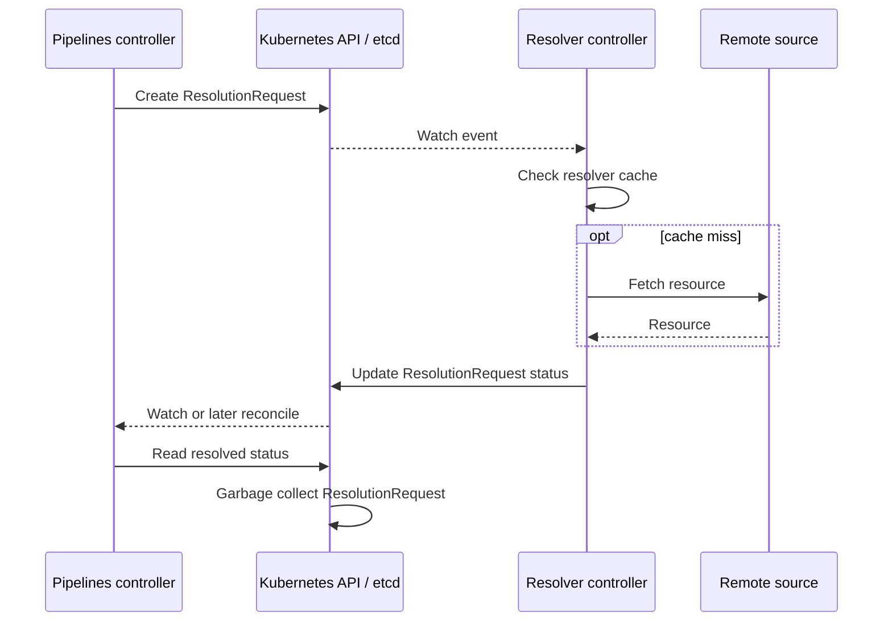
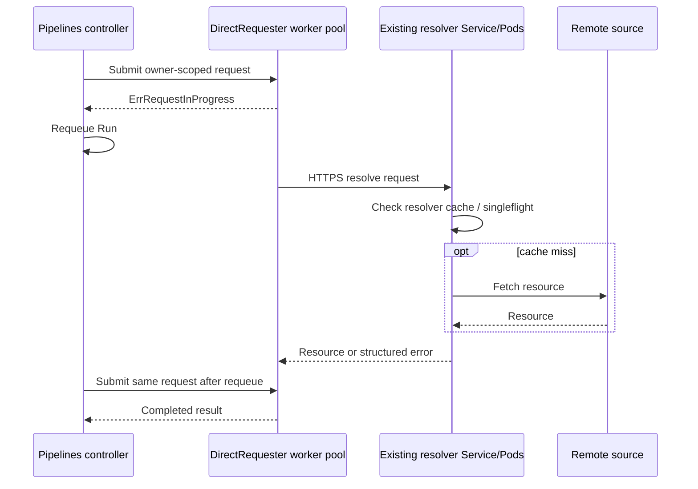

# TEP-0192: Direct Remote Resource Resolution

<!-- toc -->
- [Summary](#summary)
- [Motivation](#motivation)
  - [Why revisit TEP-0060 now?](#why-revisit-tep-0060-now)
  - [Goals](#goals)
  - [Non-Goals](#non-goals)
  - [Use Cases](#use-cases)
  - [Requirements](#requirements)
- [Proposal](#proposal)
  - [Architecture](#architecture)
  - [Compatibility](#compatibility)
  - [Notes and Caveats](#notes-and-caveats)
- [Design Details](#design-details)
  - [Transport-neutral resolution types](#transport-neutral-resolution-types)
  - [Direct requester](#direct-requester)
  - [Resolver service](#resolver-service)
  - [Protocol](#protocol)
    - [Request](#request)
    - [Success response](#success-response)
    - [Error response](#error-response)
  - [Endpoint discovery and dispatch configuration](#endpoint-discovery-and-dispatch-configuration)
  - [Caching and request de-duplication](#caching-and-request-de-duplication)
  - [Timeouts, retries, and failure semantics](#timeouts-retries-and-failure-semantics)
    - [Unresolved: durable per-reference deadline](#unresolved-durable-per-reference-deadline)
  - [High availability and restart behavior](#high-availability-and-restart-behavior)
  - [Authentication and authorization](#authentication-and-authorization)
  - [Credential and tenant isolation](#credential-and-tenant-isolation)
  - [Observability](#observability)
- [Design Evaluation](#design-evaluation)
  - [Reusability](#reusability)
  - [Simplicity](#simplicity)
  - [Flexibility](#flexibility)
  - [Conformance](#conformance)
  - [User Experience](#user-experience)
  - [Performance](#performance)
  - [Risks and Mitigations](#risks-and-mitigations)
  - [Drawbacks](#drawbacks)
- [Alternatives](#alternatives)
  - [Short-circuit the cache before creating a ResolutionRequest](#short-circuit-the-cache-before-creating-a-resolutionrequest)
  - [Continue optimizing ResolutionRequest objects](#continue-optimizing-resolutionrequest-objects)
  - [Make blocking calls from reconciliation workers](#make-blocking-calls-from-reconciliation-workers)
  - [Embed built-in resolvers in the Pipelines controller](#embed-built-in-resolvers-in-the-pipelines-controller)
  - [Offload the resolution API group](#offload-the-resolution-api-group)
  - [Add a durable database or message broker](#add-a-durable-database-or-message-broker)
  - [Reintroduce ClusterTask](#reintroduce-clustertask)
  - [Do nothing](#do-nothing)
- [Implementation Plan](#implementation-plan)
  - [Phase 0: establish a baseline](#phase-0-establish-a-baseline)
  - [Phase 1: introduce the protocol and adapters](#phase-1-introduce-the-protocol-and-adapters)
  - [Phase 2: alpha dual-mode rollout](#phase-2-alpha-dual-mode-rollout)
  - [Phase 3: evaluate graduation](#phase-3-evaluate-graduation)
  - [Phase 4: consider deprecation separately](#phase-4-consider-deprecation-separately)
  - [Test Plan](#test-plan)
  - [Infrastructure Needed](#infrastructure-needed)
  - [Upgrade and Migration Strategy](#upgrade-and-migration-strategy)
  - [Implementation Pull Requests](#implementation-pull-requests)
- [Open Questions](#open-questions)
- [References](#references)
<!-- /toc -->

## Summary

Tekton Pipelines currently coordinates remote Task, Pipeline, and StepAction
resolution through short-lived `ResolutionRequest` custom resources. Every
resolution creates an API object, writes its result or failure to status, and
later deletes the object. These writes occur even when the resolver returns a
cached result without accessing the remote source.

This TEP proposes an optional direct resolution path between the Pipelines
controller and resolver services. The direct path uses a versioned HTTPS/JSON
protocol and a bounded asynchronous requester in the Pipelines controller. It
eliminates `ResolutionRequest` CRUD for resolvers configured to use it without
changing `taskRef`, `pipelineRef`, `stepRef`, `TaskRun`, or `PipelineRun` APIs.

The existing CRD path remains available during migration. Operators select the
path explicitly per resolver, allowing built-in resolvers to migrate before
custom resolvers. This TEP does not require a database or message broker and
does not deprecate the `ResolutionRequest` API.

## Motivation

The resolver cache reduces fetch latency and load on remote systems, but it is
consulted by the resolver after a `ResolutionRequest` has already been stored.
A resolution therefore requires at least the following API writes:

1. Create the `ResolutionRequest`.
2. Update its status with resolved content or a terminal error.
3. Delete it after the owning Run no longer needs it.

There may be additional writes for condition initialization, retries, or other
status transitions. The result is write amplification for an internal
coordination operation that is not part of the Task or Pipeline author's API.

The workload described in
[tektoncd/pipeline discussion #10644](https://github.com/tektoncd/pipeline/discussions/10644)
exceeds 80,000 TaskRuns per hour and is expected to grow. The number of remote
resolutions depends on the workload, but at this scale even cached resolutions
can contribute material API server and etcd load. Moving remote content into a
cache does not remove this coordination traffic.

This pressure is independent of the remote source. Reintroducing a
cluster-scoped Task type would help only one source and would restore API scope
confusion without addressing git, bundle, hub, or HTTP resolution.

### Why revisit TEP-0060 now?

[TEP-0060](./0060-remote-resource-resolution.md) deliberately selected an
asynchronous CRD protocol. It also anticipated that rapidly creating large
`ResolutionRequest` objects could degrade API server or etcd performance and
considered direct HTTP calls as an alternative.

The direct-call alternative was not selected because it could block Pipelines
reconciliation workers and because its multi-tenant authorization, credential,
and failure semantics were not sufficiently defined. This proposal revisits
that decision with three pieces that now exist or can be reused:

- Pipelines calls resolution through a `Requester` interface, so a second
  transport can be added without changing resource resolution call sites.
- Reconciliation already understands `ErrRequestInProgress` and requeues Runs
  awaiting resolution.
- The resolver cache and singleflight implementation provide a common place to
  de-duplicate direct requests and protect remote systems.

The proposal addresses the original blocking concern by moving direct network
calls to a bounded worker pool. Reconciliation workers observe in-progress
state and return normally instead of waiting for remote I/O.

### Goals

- Eliminate creation, status update, and deletion of `ResolutionRequest`
  objects for resolutions configured to use the direct path.
- Preserve all existing user-facing remote reference syntax and resolved
  resource behavior.
- Avoid blocking TaskRun and PipelineRun reconciliation workers on resolver
  network calls.
- Preserve resolver validation, retry classification, `RefSource`, Run
  conditions, and trusted-resource verification inputs.
- Preserve the existing maximum-resolution-timeout guarantee, or make any
  alpha restart-related difference explicit until a durable per-reference
  deadline is defined.
- Provide an explicit and gradual migration path for built-in and custom
  resolvers.
- Keep memory, in-flight work, request size, and concurrency bounded.
- Maintain namespace and credential isolation at least as strong as the
  existing resolver path.
- Define measurements and graduation criteria before making the direct path a
  default.

### Non-Goals

- Replacing Kubernetes storage for `TaskRun`, `PipelineRun`, `Task`,
  `Pipeline`, or other public Tekton resources.
- Requiring PostgreSQL, another etcd cluster, Kine, an object store, or a
  message broker.
- Deprecating or removing `ResolutionRequest` in this TEP.
- Changing `taskRef`, `pipelineRef`, `stepRef`, resolver parameters, or the
  default resolver API.
- Reintroducing `ClusterTask` or adding `ClusterPipeline`.
- Making remote resolution exactly once. Resolution remains safe for
  at-least-once attempts.
- Expanding the maximum resolved resource size accepted by Tekton APIs.
- Defining storage architecture for Tekton orchestration as a whole.

### Use Cases

**High-volume shared clusters:** A cluster operator runs enough concurrent
Pipelines that short-lived resolution objects contribute meaningful etcd and
API server pressure. The operator enables direct mode for built-in resolvers
without changing user Pipeline definitions.

**Cached immutable resources:** Many Runs resolve the same git commit or OCI
digest. A cache hit returns from the resolver service without creating any
Kubernetes object.

**Gradual migration:** An operator enables direct mode for the git and bundle
resolvers while an organization-specific resolver continues using
`ResolutionRequest` until it implements the direct protocol.

**Resolver outage:** A resolver service becomes unavailable. Runs remain in the
existing resolving state and retry within bounded timeout and backoff limits.
Other controller reconciliation work continues.

**Controller restart:** A Pipelines controller restarts while direct resolution
is in flight. The new controller may repeat the request; the resolver cache and
idempotent protocol make the retry safe.

### Requirements

- A direct-mode resolution MUST cause zero `ResolutionRequest` creates,
  updates, patches, or deletes.
- Remote I/O MUST NOT run on a TaskRun or PipelineRun reconciliation worker.
- The controller MUST bound queued requests, active requests, completed
  results, response sizes, and retention time.
- Controller-side in-flight entries MUST be scoped to one owning Run reference
  and one dispatch-configuration generation; they are not a cross-Run content
  cache.
- Resolver cache keys MUST be namespace-aware, preserve ordered parameter
  values, and include resolver configuration and credential scope. Direct mode
  MUST remain disabled until the shared cache meets this requirement.
- The protocol MUST distinguish invalid or terminal requests from transient
  failures that may be retried.
- Calls MUST have per-attempt deadlines and support cancellation on deadline and
  process shutdown. Immediate cancellation when a Run is deleted is not an
  alpha requirement; abandoned work remains bounded by the attempt deadline.
- The transport MUST be encrypted and the resolver service MUST authenticate
  callers.
- Secret values MUST NOT be added to the protocol payload or observability
  labels.
- Direct and CRD dispatch MUST coexist without automatic fallback for the same
  attempt.
- Existing Run conditions, Events, `RefSource`, and verification behavior MUST
  remain equivalent across modes. Maximum-resolution-timeout behavior across
  process restarts MUST be resolved before the direct path can graduate.
- Operators MUST be able to roll back to the CRD path without editing Runs.

## Proposal

Add a transport-neutral resolution request and response model, then provide two
implementations of the existing requester boundary:

- `CRDRequester`, the existing `ResolutionRequest` implementation.
- `DirectRequester`, a bounded asynchronous HTTPS client.

For built-in resolvers, the existing `tekton-pipelines-remote-resolvers`
Deployment and Service in the `tekton-pipelines-resolvers` namespace gain a
versioned HTTPS/JSON endpoint. The existing `cmd/resolvers` process serves this
endpoint alongside the `ResolutionRequest` controllers during migration and
adapts requests to the `Validate` and `Resolve` methods on
`pkg/remoteresolution/resolver/framework.Resolver`, the interface currently
registered by that process. Built-in resolver implementations and their cache
remain in that process. The
initial topology adds no Pod, Deployment, sidecar, or Service. A custom resolver
may expose the same protocol from its own Service.

Dispatch is configured explicitly per resolver. Direct mode is disabled by
default while alpha. A resolver without direct endpoint configuration continues
using the CRD path. The controller never silently sends a failed direct request
through the CRD path because doing so can duplicate remote work and make outage
behavior unpredictable.

### Architecture

Current path:



Direct path:



The direct path does not introduce a second durable orchestration store. The
resolved Task, Pipeline, or StepAction is persisted through the same Run status
paths used today after resolution succeeds. Losing transient in-memory state
causes a retry, not loss of user state.

### Compatibility

The proposal changes no Task or Pipeline API. A resource using a resolver has
the same syntax and expected result in either dispatch mode. Existing custom
resolvers continue to work through the CRD path.

The direct protocol is a new resolver integration API. It is versioned
independently from `ResolutionRequest` so transport evolution does not require a
Kubernetes API conversion.

### Notes and Caveats

A cache hit in the resolver service still requires a network call from the
Pipelines controller, but it requires no Kubernetes write. An optional
controller-local content cache is not part of this proposal because it would
duplicate cache policy and content in two processes. It can be evaluated later
if service-call latency is material.

The direct mode removes resolution objects from Kubernetes tooling. Operators
will use Run conditions, Events, logs, metrics, and traces rather than
inspecting a `ResolutionRequest`. Equivalent observability is therefore a
requirement, not optional follow-up work.

## Design Details

### Transport-neutral resolution types

The `cmd/resolvers` process currently registers
`pkg/remoteresolution/resolver/framework.Resolver` implementations. Its
`Validate` and `Resolve` methods accept an in-memory
`*v1beta1.ResolutionRequestSpec`; this is distinct from the deprecated,
params-only `pkg/resolution/resolver/framework.Resolver` interface.

Introduce an internal transport-neutral request containing the existing
resolver inputs:

```go
type Request struct {
    Resolver  string
    Namespace string
    Params    []Param
    URL       string
}

type Response struct {
    Data      []byte
    RefSource *RefSource
}
```

`Params` preserves Tekton's existing string, array, and object values. Array
order is significant. For alpha, the HTTPS handler converts this request to an
in-memory `ResolutionRequestSpec` and invokes the currently registered resolver
without creating a Kubernetes object. `CRDRequester` remains unchanged behind
the same `Requester` boundary. Changing the resolver's Go interface is not
required by this proposal and may be considered separately.

The direct response carries the data and `RefSource` consumed by Pipelines.
Resolver annotations currently stored only on `ResolutionRequest.status` have no
Run consumer and are therefore omitted from version 1 of the direct protocol.

The wire protocol does not expose a deterministic content or idempotency key.
The controller keys transient state internally to the owning Run UID, the
specific reference being resolved, and the current dispatch-configuration
generation. The resolver service computes its own tenant-aware cache key after
it has loaded resolver configuration and credential scope. A random correlation
ID is carried in an HTTP header and trace context only.

### Direct requester

`DirectRequester` implements the existing `Requester.Submit` behavior with a
bounded in-memory state machine:

| State | `Submit` behavior |
|---|---|
| Missing | Enqueue the request and return `ErrRequestInProgress` |
| Queued, active, or backing off | Return `ErrRequestInProgress` |
| Succeeded | Return the resolved resource |
| Terminal failure | Return the mapped permanent error |

A fixed-size worker pool performs HTTPS calls. Queue capacity, worker count,
request timeout, result TTL, and maximum response size are operator-configured
with safe defaults. When the queue is full, `Submit` records backpressure and
returns `ErrRequestInProgress`; it does not start an unbounded goroutine or
expose a new transient error to reconciliation call sites.

`DirectRequester` owns retry classification, exponential backoff, and jitter.
Transient transport or service failures remain in the backing-off state, so all
current TaskRun and PipelineRun resolution call sites continue to see
`ErrRequestInProgress`. Only a successful result or terminal failure leaves the
requester. This avoids relying on call sites that currently handle transient
errors differently.

Background calls use a process-scoped context with their own deadline rather
than the reconciliation context, which ends when reconciliation returns. Runs
already requeue while receiving `ErrRequestInProgress`; the first implementation
reuses that mechanism instead of adding another durable notification object.

Completed entries are visible only to the same owning Run reference and remain
for a short bounded TTL. They are not shared across Runs. Expired or evicted
entries may be resolved again. Immediate cancellation after Run deletion is not
required in alpha; an orphaned attempt ends at its deadline or process
shutdown.

### Resolver service

The existing `tekton-pipelines-remote-resolvers` Service adds an HTTPS port
(targeting `8443` by default) for the current resolver Pods. The existing
`cmd/resolvers` container serves one endpoint and routes requests by resolver
name to the existing resolver implementations. It continues running the CRD
controllers while either resolver dispatch mode is enabled. The service:

1. Authenticates and authorizes the caller.
2. Validates protocol and payload size.
3. Injects request namespace and resolver configuration into context.
4. Calls the resolver's existing validation.
5. Uses the existing cache and singleflight path where enabled.
6. Calls the resolver implementation on a cache miss.
7. Validates the returned resource.
8. Returns a bounded response or structured error.

The service has no required durable state. Multiple replicas may sit behind a
Kubernetes Service. Their in-memory caches need not be coherent for
correctness; a miss on one replica may repeat a remote fetch.

### Protocol

The initial protocol uses HTTPS and JSON. HTTPS/JSON is preferred over a
required gRPC stack because it is easy to implement in different languages,
works with standard operational tooling, and does not require generated client
code. The API can use HTTP/2 without changing its representation.

The endpoint is:

```text
POST /v1alpha1/resolvers/{resolver}/resolve
```

The protocol sets strict request and response size limits. Unknown fields are
rejected during alpha to reveal version skew rather than silently changing
meaning.

#### Request

```json
{
  "namespace": "team-a",
  "params": [
    {"name": "url", "value": "https://github.com/tektoncd/catalog.git"},
    {"name": "revision", "value": "0123456789abcdef"},
    {"name": "path", "value": "task/git-clone/0.10/git-clone.yaml"}
  ],
  "url": ""
}
```

The resolver name comes from the path. The caller identity is carried by the
authenticated transport, not the JSON body. `X-Request-ID` is an opaque random
correlation value and has no cache or idempotency semantics.

#### Success response

```json
{
  "data": "YXBpVmVyc2lvbjogdGVrdG9uLmRldi92MQo...",
  "refSource": {
    "uri": "https://github.com/tektoncd/catalog.git",
    "digest": {
      "sha256": "0123456789abcdef0123456789abcdef0123456789abcdef0123456789abcdef"
    }
  }
}
```

`data` is base64 encoded because resolved content is arbitrary bytes. The
client validates and decodes it before existing Task, Pipeline, or StepAction
validation and trusted-resource verification.

#### Error response

```json
{
  "reason": "ResolutionFailed",
  "message": "remote resource was not found"
}
```

HTTP status determines terminal versus transient classification. The body
provides a stable Tekton reason and a safe human-readable message; it cannot
override the status class.

| Status | Meaning |
|---|---|
| `400`, `404`, or another unlisted `4xx` | Invalid or unsupported request; terminal |
| `401` or `403` | Authentication or authorization failure; refresh the client token once, then terminal |
| `408`, `425`, or `429` | Timeout, not ready, overload, or rate limiting; transient |
| `413` | Request or resolved content exceeds its limit; terminal |
| `500` through `599` | Resolver or dependency failure; transient |

The client honors a valid, bounded `Retry-After` value. Connection, DNS, and
service-unavailable errors are transient. TLS trust or server-name failures are
configuration errors: they remain in progress with backoff and a dedicated
operator metric until the durable maximum-resolution deadline is reached.
Malformed `2xx` responses and unknown reason values are transient protocol
failures during alpha. Missing error bodies receive a transport-derived reason
and a non-sensitive message.

### Endpoint discovery and dispatch configuration

An operator-owned `resolver-dispatch` ConfigMap in the `tekton-pipelines`
namespace selects dispatch per resolver and registers named direct endpoints:

```yaml
apiVersion: v1
kind: ConfigMap
metadata:
  name: resolver-dispatch
  namespace: tekton-pipelines
data:
  config.yaml: |
    apiVersion: resolution.tekton.dev/v1alpha1
    defaultMode: crd
    endpoints:
      builtins:
        url: https://tekton-pipelines-remote-resolvers.tekton-pipelines-resolvers.svc:8443
        serverName: tekton-pipelines-remote-resolvers.tekton-pipelines-resolvers.svc
        caBundleSecretRef:
          name: resolver-client-ca
          key: ca.crt
        audience: tekton-resolver-builtins
    resolvers:
      git:
        mode: direct
        endpoint: builtins
      bundles:
        mode: direct
        endpoint: builtins
      company-resolver:
        mode: crd
```

`mode` is `crd` or `direct`. A direct resolver MUST name an endpoint. Endpoint
URLs MUST use HTTPS. The CA Secret is read from `tekton-pipelines`; resolver
names and endpoint names are DNS labels. Unknown fields and references are
configuration errors.

Configuration is cluster-wide. The selected mode is intended to be
semantically invisible to users and therefore does not vary by namespace.
Config updates are parsed and validated as a whole. An invalid update keeps the
last known good generation and emits a metric and error log; it never partially
applies and never silently changes a resolver to CRD mode.

Every successful reload creates a new dispatch generation. New requests use the
new generation. In-flight calls may finish, but completed entries from an old
generation cannot satisfy a new `Submit`. Endpoint, CA, server name, audience,
mode, resolver configuration, and credential-scope changes also invalidate the
corresponding resolver cache generation. Operators roll back by explicitly
setting the resolver to `crd`.

### Caching and request de-duplication

The resolver cache remains authoritative for resolved content. Direct requests
pass through the same cache policy as CRD requests. Cache policy stays within
the scope of [TEP-0161](./0161-resolver-caching.md). This proposal requires the
namespace-aware keying and invalidation promised by that TEP to be corrected
before direct mode is enabled; it does not introduce a second cache policy.

The current cache implementation is not sufficient for direct mode: its key is
resolver name plus parameters, it omits namespace and credential/configuration
scope, and it sorts array values even though Tekton arrays are ordered. Direct
mode MUST remain disabled until the shared cache key API is corrected.

The corrected key defaults to namespace scope and uses a versioned structured
encoding that preserves parameter types and array order while sorting only
object keys and validated parameter names. It also includes the resolver
configuration generation and a resolver-provided credential scope. If a
resolver cannot provide a stable credential scope, caching for that request is
disabled. A resolver may explicitly declare globally public immutable content
safe for broader sharing.

Resolver configuration and watched credential changes increment the applicable
cache generation or evict affected entries. This prevents a response obtained
under old policy or credentials from being reused after a change.

The controller's direct-request table is separate and owner-scoped. It retains
a completed response only long enough for the same Run reference to consume it;
it is not a second configurable content cache.

### Timeouts, retries, and failure semantics

Three limits apply:

1. A durable maximum-resolution deadline for the reference.
2. A shorter per-attempt HTTPS deadline.
3. Queue and concurrency limits in the client and server.

A terminal response maps to the existing failed-resolution reason and is not
retried. `DirectRequester` retains transient failures as in-progress work and
applies exponential backoff and jitter internally. Reconciliation call sites
continue to receive `ErrRequestInProgress` until success, terminal failure, or
the durable deadline.

#### Unresolved: durable per-reference deadline

The CRD path derives its maximum resolution timeout from the durable
`ResolutionRequest.metadata.creationTimestamp`. Process-local requester state
cannot preserve that deadline across controller restart, eviction, or
leadership movement. Before direct mode can be enabled, the implementation must
either persist an absolute per-reference deadline on the owning Run without an
unbounded metadata field, or the community must explicitly accept and document
different alpha restart semantics. The overall Run timeout is not equivalent
because it may be disabled and a reference can first be resolved long after a
PipelineRun starts.

Resolvers MUST tolerate duplicate requests. A resolver performing externally
visible mutation is outside the remote-resolution contract.

Automatic fallback from direct to CRD is prohibited for an individual attempt.
It could execute the same remote request twice, bypass direct-path policy, and
hide a resolver service outage. Mode changes are explicit operator actions.

### High availability and restart behavior

The resolver service is horizontally scalable behind a Kubernetes Service. It
is stateless except for bounded per-replica caches and singleflight state.
Replicas do not provide cluster-wide request de-duplication.

If a resolver replica stops, the requester retains the operation as in progress
and retries with backoff. If a Pipelines controller stops, its queued and
completed direct requests are lost. The replacement controller submits them
again. Successful resolved specs remain recorded through existing Run status
paths; recovery of an unfinished attempt depends on the durable deadline
decision above, not on exactly-once request state.

The deployment adds an HTTPS port and certificate Secret, reports ready after
resolver registration, TLS material, and the listener are ready, and drains
active requests during graceful shutdown. Client-side dispatch configuration is
not part of resolver Pod readiness; an invalid update keeps the controller's
last known good generation. Production HA guidance requires at least two
replicas and a PodDisruptionBudget; alpha tests cover both one- and multi-replica
deployments.

This provides at-least-once resolution attempts and availability through
retries. Exactly-once remote fetching and cross-replica cache coherence are
neither required nor promised.

### Authentication and authorization

Every endpoint MUST use TLS. For each endpoint, the controller validates the
certificate against the configured CA bundle and `serverName`. CA Secret
updates are watched and applied through the atomic dispatch-generation reload
described above, allowing operators to overlap old and new trust during
certificate rotation.

Each endpoint configures a distinct ServiceAccount token audience. The
controller obtains a short-lived token for that audience with Kubernetes's
TokenRequest API and caches it no longer than its expiry. The resolver service
submits the same audience in TokenReview and rejects a token that was not issued
for it. After one forced token refresh, repeated `401` or `403` responses are
terminal for the Run. The service permits only configured Pipelines controller
ServiceAccounts. Token values are never logged, forwarded, or included in
cache keys.

The authenticated controller is trusted to state the Run namespace in the
request, matching the controller's existing cluster-wide authority. Custom
resolver services may apply additional namespace or parameter policy before
resolution. NetworkPolicy SHOULD restrict resolver endpoints to expected
callers as defense in depth.

A future mTLS profile may remove TokenRequest and TokenReview calls, but it is
not required for the initial protocol.

### Credential and tenant isolation

The protocol carries resolver parameters, not Secret contents. Resolver
implementations continue to load credentials according to their existing
namespace and configuration rules.

The service injects the request namespace into resolver context before
validation and resolution. Namespace, resolver configuration generation, and a
resolver-provided credential scope participate in cache scope. A resolver that
cannot safely identify credential scope does not cache that request. Metrics
MUST NOT use namespace, URL, revision, Secret name, or request ID as unbounded
labels.

### Observability

Direct mode provides metrics for:

- requests, successes, terminal failures, and transient failures by resolver;
- request duration and queue duration;
- queued and active requests;
- queue rejection and timeout counts;
- cache hit, miss, store, and singleflight sharing;
- protocol and response-size failures; and
- dispatch mode.

Trace context is propagated from Run reconciliation to the resolver service.
Logs include the resolver and request ID but not parameters or credentials.
Existing Run conditions and Kubernetes Events continue to report resolving,
success, timeout, and failure states.

The initial rollout SHOULD provide a dashboard comparing CRD and direct modes,
including Kubernetes API request rates and controller queue depth.

## Design Evaluation

### Reusability

This proposal reuses the resolver interface, requester boundary, cache,
singleflight, Run requeue semantics, error reasons, and resolved-resource types.
It changes how internal runtime coordination occurs, not how Tasks or Pipelines
are authored.

The versioned protocol can be implemented by built-in or third-party resolvers
without requiring them to run a Kubernetes reconciler.

### Simplicity

The proposal adds one internal HTTPS handler and a bounded in-memory dispatcher
to existing processes, but removes a Kubernetes object lifecycle from every
direct resolution. It does not add a Pod, Deployment, Service, durable store,
public Tekton API, or templating mechanism.

Operators that do not enable the feature see no change. Users do not need to
know which dispatch path is active.

### Flexibility

The protocol does not require a resolver implementation language or remote
storage medium. Operators may run the built-in resolver service, register a
custom service, or retain the CRD path.

Tekton is coupled only to the protocol, not Hatchet, kube-shard, PostgreSQL,
Kine, gRPC, or a message broker.

### Conformance

No Tekton API field changes. The same Task and Pipeline resources remain valid
across installations and dispatch modes. Direct resolution separates internal
orchestration from Kubernetes storage while preserving Tekton's public
Kubernetes-native contract.

The operator configuration must not change resolved content or user-visible
semantics. Therefore direct mode does not require an API specification change.

### User Experience

Task and Pipeline authors use the same remote references. Removing Kubernetes
persistence and informer delivery may reduce resolution latency, but this is a
Phase 0/alpha benchmark hypothesis rather than a compatibility guarantee.

Operators lose `kubectl get resolutionrequests` as a diagnostic for direct
requests. Equivalent Run conditions, Events, metrics, traces, and structured
logs must be available before graduation.

### Performance

Before implementation, a reproducible benchmark must isolate the share of API
server and etcd load caused by `ResolutionRequest` objects. Measurements include:

- resolutions and `ResolutionRequest` writes per second;
- API server request rate and latency;
- etcd write rate, database size, and compaction behavior;
- TaskRun and PipelineRun controller queue depth and reconcile latency;
- resolver queue depth, active requests, and cache hit ratio;
- end-to-end resolution latency; and
- controller and resolver CPU and memory.

The benchmark covers cache hits, cache misses, repeated immutable references,
unique references, resolver latency, rate limiting, service outage, controller
restart, and projected high-volume workload.

The direct path can graduate from alpha only when it demonstrates:

- zero `ResolutionRequest` CRUD in direct mode;
- no unbounded growth in controller memory, goroutines, or queues;
- no material regression in Run reconciliation latency or resolver success
  rate compared with the CRD path; and
- a material reduction in Kubernetes API and etcd writes attributable to
  resolution.

Absolute throughput and latency thresholds will be set from Phase 0 results
rather than asserted without a reproducible environment.

### Risks and Mitigations

| Risk | Mitigation |
|---|---|
| Controller memory grows with in-flight or completed requests | Bound queue, workers, response size, entry count, and TTL; export saturation metrics |
| Remote calls starve reconciliation workers | Perform calls only in the direct requester worker pool and return `ErrRequestInProgress` |
| Controller restart repeats a fetch | Require idempotent resolution and reuse resolver cache/singleflight |
| Cross-tenant cache leakage | Block direct mode until the cache preserves array order and includes namespace, config generation, and credential scope; disable caching when scope is unknown |
| Service endpoint is impersonated | Validate TLS with per-endpoint CA and server name; rotate trust atomically |
| Token replay across endpoints | Use short-lived endpoint-audience tokens and require that audience in TokenReview |
| Unauthorized caller invokes resolver | Validate ServiceAccount tokens and allow only configured controller identities |
| TokenReview adds API load | Cache successful validation until token expiry and measure it during load tests |
| Direct and CRD paths drift semantically | Share transport-neutral types, resolver validation, cache, error mapping, and conformance tests |
| Resolver outage causes a retry storm | Bound concurrency, use exponential backoff and jitter, honor Retry-After, and expose circuit saturation |
| Automatic fallback duplicates work or bypasses policy | Require explicit dispatch mode; never automatically fall back per attempt |
| Direct requests are harder to inspect | Preserve Run conditions and Events; add protocol metrics, traces, and request-ID logs |
| Large responses exhaust memory | Enforce response limit while streaming and reject with a terminal size error |
| Custom resolvers cannot migrate immediately | Retain CRD mode per resolver throughout rollout |

### Drawbacks

- Tekton must own and version an internal service protocol.
- Operators enabling direct mode operate a network service and its TLS trust.
- In-memory coordination can repeat remote work after failover.
- Supporting two dispatch paths temporarily increases tests and maintenance.
- `ResolutionRequest` is directly observable with Kubernetes tools; direct
  requests require different diagnostics.
- The direct path removes resolution writes but does not address etcd pressure
  from Run, Pod, Event, or other Kubernetes resources.

## Alternatives

### Short-circuit the cache before creating a ResolutionRequest

The Pipelines controller could maintain or query a cache before creating a CRD.
This is a useful near-term optimization for hits, but misses still create
`ResolutionRequest` objects and it duplicates cache policy across controller and
resolver processes. It may be implemented independently but does not replace
the direct path.

### Continue optimizing ResolutionRequest objects

Tekton could reduce status updates, shorten retention, de-duplicate identical
requests, or store references instead of in-line data. These reduce object size
or write count but retain Kubernetes persistence and informer coordination for
an internal request.

### Make blocking calls from reconciliation workers

A reconciliation worker could call the resolver endpoint directly and wait.
This is the smallest code change, and it was considered by TEP-0060. A slow or
unavailable resolver could consume all controller workers, delaying unrelated
Runs. The bounded asynchronous requester avoids that failure mode.

### Embed built-in resolvers in the Pipelines controller

The Pipelines controller could link every built-in resolver and call it as a Go
function, avoiding a network protocol. This would move resolver dependencies,
configuration, credentials, RBAC, resource consumption, and failures into the
main controller. It would also couple resolver scaling to Run reconciliation
and would not provide a migration path for non-Go or separately deployed custom
resolvers. Reusing the existing resolver process with one internal endpoint is
the smaller operational change.

### Offload the resolution API group

An aggregated API server such as
[kube-shard](https://github.com/konflux-ci/kube-shard) can move
`resolution.tekton.dev` storage from the primary etcd to another backend while
preserving Kubernetes APIs. This can protect the primary control plane, but it
retains create, update, watch, and delete churn and adds a secondary API server,
Kine, and database stack. It is a platform-level mitigation, not a dependency
Tekton should require for remote resolution.

### Add a durable database or message broker

A separate orchestration store could retain in-flight operations across
controller and service restarts. Systems such as
[Hatchet](https://docs.hatchet.run/v1/architecture-and-guarantees) demonstrate
this architecture. Tekton already has a durable Run as the source of desired
state, and remote resolution is safe to repeat. A required database or broker
would add operational cost without being necessary for correctness. It can be
reconsidered if measured requirements cannot be met with bounded retries.

### Reintroduce ClusterTask

A cluster-scoped Task avoids remote resolution only for shared in-cluster
Tasks. It does not address git, bundle, hub, or HTTP references and restores the
scope and tenancy problems that motivated its removal.

### Do nothing

The current CRD path is Kubernetes-native and operationally understood. Cache
hits still cause API and etcd writes, but Phase 0 may show that their share is
not material or that a smaller optimization meets the target. In that case this
proposal should stop before a new protocol is implemented.

## Implementation Plan

### Phase 0: establish a baseline

- Add or verify metrics that count resolution operations and CRD writes.
- Build a reproducible benchmark for cache-hit and cache-miss workloads.
- Record API server, etcd, controller queue, memory, and latency baselines.
- Compare direct resolution with cache short-circuiting and CRD write
  reductions, not only with the current implementation.
- Publish the results and set numeric alpha and beta graduation thresholds.
- Ask the Pipelines and API working groups for an explicit stop/proceed
  decision. Phase 1 does not begin unless `ResolutionRequest` traffic is a
  material bottleneck and the smaller alternatives cannot meet the agreed
  target.

### Phase 1: introduce the protocol and adapters

- Correct the shared cache key API so it is tenant-aware, preserves array
  order, and invalidates on resolver configuration or credential-scope change.
- Resolve and test durable maximum-resolution-timeout semantics.
- Define transport-neutral request, response, and error types.
- Add the direct handler adapter from the transport-neutral request to the
  current in-memory `ResolutionRequestSpec`; leave `CRDRequester` and resolver
  implementations unchanged.
- Implement protocol conformance tests before adding network transport.
- Add the HTTPS server adapter to the built-in resolver deployment.
- Add per-endpoint TLS trust, audience-bound ServiceAccount authentication,
  readiness, and graceful shutdown.

### Phase 2: alpha dual-mode rollout

- Implement the bounded asynchronous `DirectRequester`.
- Add explicit per-resolver dispatch configuration, defaulting to CRD.
- Enable direct mode for built-in resolvers in end-to-end tests.
- Add mixed-mode tests with a custom CRD resolver.
- Run failure, restart, security, and load tests.
- Publish operator-facing diagnostics and rollback instructions.

### Phase 3: evaluate graduation

- Compare direct and CRD results against Phase 0.
- Resolve semantic differences found by conformance tests.
- Gather feedback from custom resolver authors and large-cluster operators.
- Consider making direct mode the default for built-in resolvers only after
  graduation criteria are met.

### Phase 4: consider deprecation separately

This TEP does not remove `ResolutionRequest`. A later TEP may propose
deprecation after custom resolver migration, compatibility, and support windows
are understood.

### Test Plan

**Unit tests:**

- owner/reference/config-generation requester keys;
- tenant-aware resolver cache keys, ordered arrays, config generation, and
  disabled caching when credential scope is unknown;
- requester state transitions, TTL, eviction, queue saturation, backoff, and
  races;
- request and response limits;
- HTTP status and Tekton error mapping;
- backoff, timeout, and cancellation;
- authentication and authorization decisions; and
- CRD/direct conformance for resolver validation and responses.

**Integration tests:**

- resolver server with each built-in resolver;
- TLS trust, server-name checks, CA rotation, audience-bound TokenRequest, and
  TokenReview validation;
- cache hit, cache miss, and singleflight behavior;
- multiple resolver and controller replicas;
- resolver and controller restart during active requests; and
- explicit mode changes and rollback.

**End-to-end tests:**

- Task, Pipeline, child Pipeline, and StepAction resolution;
- trusted-resource verification and resolved metadata;
- mixed direct and CRD resolvers in one PipelineRun;
- terminal and transient remote failures;
- no `ResolutionRequest` objects in direct mode; and
- unchanged TaskRun/PipelineRun conditions and Events.

**Load and soak tests:**

- projected high-volume cache-hit and cache-miss workloads;
- unique and shared references;
- endpoint rate limiting and outage;
- queue saturation and bounded memory; and
- API server and etcd write comparison with CRD mode.

### Infrastructure Needed

No new Tekton project, Pod, Deployment, Service, sidecar, or mandatory external
database is required for built-in resolvers. The existing
`tekton-pipelines-remote-resolvers` Deployment, Service, and `cmd/resolvers`
container gain an HTTPS port and handler, serving certificate Secret, readiness
and graceful-shutdown behavior, and production HA/PDB guidance. CI needs a
TLS-enabled resolver service and load-test environment capable of collecting
API server, etcd, controller, and resolver metrics.

### Upgrade and Migration Strategy

- The direct path ships disabled during alpha.
- Existing installations remain on CRD mode after upgrade.
- Operators enable direct mode per resolver after deploying and validating an
  endpoint.
- The existing built-in resolver process serves both CRD and direct requests
  during migration and shares the same cache implementation.
- A custom resolver remains on CRD mode until it implements the protocol.
- Operators roll back by explicitly setting that resolver to CRD mode.
- In-flight direct requests may be repeated after a mode change; resolution is
  idempotent and Runs remain the durable desired state.
- No user resource migration or YAML change is required.

### Implementation Pull Requests

To be added as implementation pull requests merge.

## Open Questions

The following must be answered with Phase 0 data or community review before the
TEP moves to `implementable`:

1. How should an absolute per-reference maximum-resolution deadline be stored
   durably without creating another per-resolution object or an unbounded Run
   metadata field?
2. What default worker count, queue size, per-attempt deadline, result TTL, and
   response limit are safe for supported cluster sizes?
3. Should completion trigger an immediate Run enqueue after the first alpha
   implementation, or is the existing timed requeue sufficient?
4. Which cache scope can each built-in resolver prove, and which requests must
   remain uncached because credential scope is unknown?
5. What measured Phase 0 threshold justifies proceeding, and what thresholds
   are required for beta and for making direct mode the built-in default?

## References

- [Discussion: Reducing etcd pressure from ResolutionRequest CRDs at scale](https://github.com/tektoncd/pipeline/discussions/10644)
- [TEP-0060: Remote Resource Resolution](./0060-remote-resource-resolution.md)
- [TEP-0091: Trusted Resources](./0091-trusted-resources.md)
- [TEP-0133: Configure Default Resolver](./0133-configure-default-resolver.md)
- [TEP-0154: Concise Remote Resolver Syntax](./0154-concise-remote-resolver-syntax.md)
- [TEP-0161: Resolver Caching](./0161-resolver-caching.md)
- [Tekton Pipelines resolver framework](https://github.com/tektoncd/pipeline/tree/main/pkg/remoteresolution)
- [kube-shard](https://github.com/konflux-ci/kube-shard)
- [Hatchet architecture and guarantees](https://docs.hatchet.run/v1/architecture-and-guarantees)
